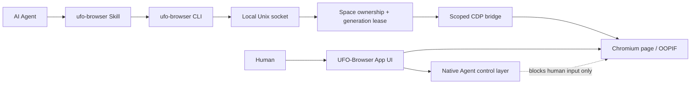

# UFO-Browser

<p align="center">
  
</p>

**A high-performance Chromium browser built for AI Agents and people.**

UFO-Browser is a local-first macOS browser where humans and AI Agents work in persistent, isolated Task Spaces. Agents can reuse the user's browser session, operate real Chromium pages through CDP, and continue working in the background without moving the system pointer, opening a remote-debugging port, or fighting the user for control.

The project is designed around one idea: an Agent browser should feel like a real browser first—and an automation runtime second.

## Why UFO-Browser

- **Agent-native Task Spaces** — each task keeps its own tabs, lifecycle, ownership state, and live page context.
- **Real Chromium input** — clicks, typing, wheel events, drag operations, screenshots, and OOPIF interaction flow through Chromium's DevTools Protocol.
- **Human/Agent control isolation** — an App-level control layer blocks human input while an Agent is active without being injected into the website DOM or appearing in page screenshots.
- **Reusable login state** — Agents can work with the browser's existing authenticated session while remaining separated from the user's current page flow.
- **No visible automation cursor** — Agent input never moves the macOS pointer and does not rely on OS-level keyboard or mouse automation.
- **Bounded background rendering** — hidden Agent pages use a shared compositor surface only when required, then park again to reduce GPU usage.
- **Live Overview** — persistent 3:2 Space previews update with page activity while using adaptive capture cadence and caching.
- **Ego-compatible Agent API** — the JavaScript helper surface supports the familiar Task Space, snapshot, input, wait, fetch, screenshot, and CDP workflows.

## Architecture



The visible browser page and Agent control layer are separate native views. The overlay belongs to the App, not the website, so Agent CDP input and page screenshots remain unaffected while human interaction is safely blocked.

## Performance model

UFO-Browser avoids keeping every background page at foreground rendering priority.

- Overview capture uses bounded concurrency, adaptive frame cadence, preview signatures, and a small revision cache.
- Background Agent pages attach to an invisible compositor surface only for input, screenshots, waits, screencasts, or challenge execution.
- Completed, handed-off, or disconnected Spaces release their active compositor allocation immediately.
- Hidden renderers retain page state while Chromium's native background throttling limits unnecessary animation and timer work.
- Agent status animations use compositor-friendly opacity and transform changes instead of full-page blur effects.

The repository includes GPU-budget, restart-scale, live-preview, window-lifecycle, and browser-interaction regression suites.

## Agent usage

UFO-Browser ships a JavaScript Skill and CLI. Run browser operations as a heredoc:

```bash
ufo-browser nodejs <<'EOF'
const task = await useOrCreateTaskSpace('inspect example page')

await openOrReuseTab('https://example.com', {
  wait: true,
  timeout: 20,
})

cliLog(await snapshotText())
EOF
```

Common helpers include:

- Task Spaces: `useOrCreateTaskSpace`, `claimTaskSpace`, `handOffTaskSpace`, `takeOverTaskSpace`, `completeTaskSpace`
- Navigation: `openOrReuseTab`, `gotoAndWait`, `listTabs`, `switchTab`, `closeTab`
- Observation: `snapshotText`, `pageInfo`, `captureScreenshot`, `drainEvents`
- Input: `click`, `doubleClick`, `hover`, `dragMouse`, `fillInput`, `typeText`, `pressKey`, `scroll`
- Browser access: `js`, `cdp`, `browserFetch`, `serverFetch`

See [skills/ufo-browser/SKILL.md](skills/ufo-browser/SKILL.md) for the complete workflow and [skills/ufo-browser/references/cli-parity.md](skills/ufo-browser/references/cli-parity.md) for the Ego compatibility matrix.

## Getting started

Requirements:

- macOS
- Node.js 22+
- npm

Install and build:

```bash
npm install
npm run build
npm test
```

Run the development App:

```bash
npm run test:app
```

Reuse the existing test profile without rebuilding:

```bash
npm run test:app:reuse
```

## Verification

The most important regression gates are available as npm scripts:

```bash
npm run typecheck
npm test
npm run verify:control-ui
npm run verify:browser-interaction
npm run verify:live-preview
npm run verify:restart-scale
npm run verify:agent-initial-tab
npm run verify:helper-parity
npm run verify:fingerprint
npm run verify:janitor
```

These suites cover Task Space leases, native input isolation, tab lifecycle, OOPIF routing, semantic snapshots, helper parity, Chromium fingerprint behavior, live page previews, GPU parking, and JanitorAI Turnstile completion.

## macOS builds

Day-to-day development builds never modify global Agent Skill folders:

```bash
npm run dist:mac
npm run package:mac:test
```

The infrequently used formal packaging flow runs all checks, updates the managed `ufo-browser` Skill for installed Claude Code, Codex, and other supported Agent Skills clients, then produces and verifies the App, DMG, and ZIP:

```bash
npm run skills:sync:dry-run
npm run package:mac
```

See [docs/macos-build.md](docs/macos-build.md) for target directories, ownership safeguards, temporary-build behavior, and signing limitations.

## Security and isolation

- Agent transport is a current-user-only Unix socket with restrictive filesystem permissions.
- Every mutating Agent command is scoped to one selected Space and generation lease.
- Browser targets and cross-site iframe sessions are filtered so one Space cannot inspect another.
- Renderer access is exposed through context-isolated preload allowlists.
- UFO-Browser does not enable Electron remote debugging or expose a general-purpose browser endpoint.
- User takeover is a hard stop: Agent commands cannot silently reclaim a user-controlled Space.

## Project status

The current milestone focuses on the pure browser experience and Agent runtime:

- Chromium browser shell and persistent Task Spaces
- Agent Skill/CLI compatibility
- Native Agent control overlay
- Live Overview previews
- OOPIF and Turnstile behavior
- Fingerprint and helper parity regression gates
- Bounded GPU and background compositor usage

Chrome Profile/Cookie import is intentionally deferred. It will be implemented later as an explicit, one-time encrypted import flow rather than implicit access to another browser's profile.

## Ego compatibility

UFO-Browser implements its own App, host bridge, Task Space manager, preview system, CLI, and Agent runtime. Ego is used as a behavioral compatibility reference for the public helper workflow; UFO-Browser does not load Ego or `ego-lite` as part of the product runtime.

The primary executable and Skill name are now `ufo-browser`. A legacy `x-browser` CLI alias and selected internal identifiers remain temporarily available so existing scripts and persisted development profiles continue to work during the rename.

## Development notes

The detailed architecture, protected contracts, implementation history, and verification evidence are maintained in [goal.md](goal.md).
