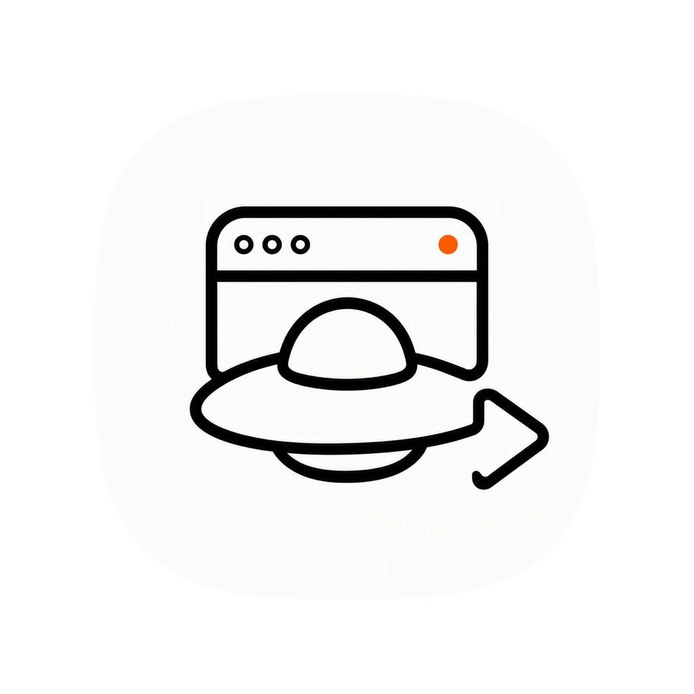
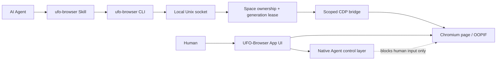

# UFO-Browser

<p align="center">
  
</p>

**A high-performance Chromium browser built for AI Agents and people.**

UFO-Browser is a local-first macOS browser where humans and AI Agents work in persistent, isolated Task Spaces. Agents can reuse the user's browser session, operate real Chromium pages through CDP, and continue working in the background without moving the system pointer, opening a remote-debugging port, or fighting the user for control.

The project is designed around one idea: an Agent browser should feel like a real browser first—and an automation runtime second.

## Why UFO-Browser

- **Agent-native Task Spaces** — each task keeps its own tabs, lifecycle, ownership state, and live page context.
- **Real Chromium input** — clicks, typing, wheel events, drag operations, screenshots, and OOPIF interaction flow through Chromium's DevTools Protocol.
- **Human/Agent control isolation** — an App-level control layer blocks human input while an Agent is active without being injected into the website DOM or appearing in page screenshots.
- **Reusable login state** — Agents can work with the browser's existing authenticated session while remaining separated from the user's current page flow.
- **One-time Spaces** — the built-in Temporary Profile creates a fresh memory-backed Chromium Session for every human or Agent Space; Cookie, LocalStorage, IndexedDB, Service Worker, cache, and permission state are never shared, closing clears the Session, and App restart never restores it.
- **One-click Chrome login import and opt-in sync** — copy a selected local Chrome Profile's Cookies, CHIPS, Local Storage, IndexedDB, WebStorage, and OPFS into a new isolated UFO Profile, then incrementally follow that Profile without modifying Chrome or reviving a UFO logout.
- **No visible automation cursor** — Agent input never moves the macOS pointer and does not rely on OS-level keyboard or mouse automation.
- **One UFO browser host** — Overview, every Space, and internal Profile Cookie transactions are scheduled inside one shared UFO CEF main process; they never launch separate browser Hosts.
- **Bounded background rendering** — ordinary warm background Spaces park their native compositor without losing page state; Agent-owned Spaces stay awake only while automation requires them.
- **Live Overview** — persistent 3:2 Space previews update with page activity while using adaptive capture cadence and caching.
- **Ego-compatible Agent API** — the JavaScript helper surface supports the familiar Task Space, snapshot, input, wait, fetch, screenshot, and CDP workflows.

## Architecture



The visible browser page and Agent control layer are separate native views. The overlay belongs to the App, not the website, so Agent CDP input and page screenshots remain unaffected while human interaction is safely blocked.

## Performance model

UFO-Browser avoids keeping every background page at foreground rendering priority while preserving one shared browser Host.

- Overview capture uses one global low-frequency queue, adaptive frame cadence, preview signatures, and a small revision cache.
- A preview wakes one selected warm Space, captures it, and parks its native window again; a hidden Overview cannot wake Spaces through stale polling.
- Agent-owned background Spaces stay compositor-awake for input, screenshots, waits, screencasts, and challenge execution, while remaining invisible and non-interactive to people.
- Completed, handed-off, or disconnected Spaces release their active compositor allocation immediately.
- Hidden renderers retain page state while Chromium's native background throttling limits unnecessary animation and timer work.
- Agent status animations use compositor-friendly opacity and transform changes instead of full-page blur effects.

The repository includes GPU-budget, restart-scale, live-preview, window-lifecycle, and browser-interaction regression suites.

## Agent usage

UFO-Browser ships a JavaScript Skill and CLI. Run browser operations as a heredoc:

```bash
ufo-browser nodejs <<'EOF'
const task = await bootstrapTaskSpace({
  name: 'inspect example page',
  url: 'https://example.com/',
})

await openOrReuseTab('https://example.com', {
  wait: true,
  timeout: 20,
})

cliLog(await snapshotText())
EOF
```

For a fresh one-time browser identity instead of the current persistent login
Profile, select the built-in Temporary Profile:

```bash
ufo-browser nodejs <<'EOF'
const profiles = await listProfiles()
const task = await taskSpaces.bootstrap({
  name: 'isolated signup',
  profileId: 'Temporary',
})
cliLog({ profiles, task })
EOF
```

Each Temporary Space owns a unique non-`persist:` Chromium partition. The
template itself is visible in Profile management and the new-Space menu, but
is not written to `profiles.json` and cannot replace the user's persistent
default Profile.

Common helpers include:

- Task Spaces: `bootstrapTaskSpace`, `useTaskSpace`, `claimTaskSpace`, `handOffTaskSpace`, `takeOverTaskSpace`, `completeTaskSpace`
- Navigation: `openOrReuseTab`, `gotoAndWait`, `listTabs`, `switchTab`, `closeTab`
- Observation: `snapshotText`, `pageInfo`, `captureScreenshot`, `drainEvents`
- Input: `click`, `doubleClick`, `hover`, `dragMouse`, `fillInput`, `typeText`, `pressKey`, `scroll`
- Browser access: `js`, `cdp`, `browserFetch`, `serverFetch`

See [skills/ufo-browser/SKILL.md](skills/ufo-browser/SKILL.md) for the complete workflow and [skills/ufo-browser/references/cli-parity.md](skills/ufo-browser/references/cli-parity.md) for the Ego compatibility matrix.

## Getting started

Requirements:

- macOS
- Node.js 22+
- npm

Install and build:

```bash
npm install
npm run build
npm test
```

Install the development CLI into `~/.local/bin` so the Skill can call
`ufo-browser` directly from any working directory:

```bash
npm run cli:install:local
```

The installer preserves an unrelated existing command by default. Use
`npm run cli:install:local -- --force` only after reviewing that exact path.

Run the development App:

```bash
npm run test:app
```

Reuse the existing test profile without rebuilding:

```bash
npm run test:app:reuse
```

## Verification

The most important regression gates are available as npm scripts:

```bash
npm run typecheck
npm test
npm run verify:control-ui
npm run verify:browser-interaction
npm run verify:live-preview
npm run verify:restart-scale
npm run verify:agent-initial-tab
npm run verify:agent-focus-isolation
npm run verify:helper-parity
npm run verify:fingerprint
npm run verify:janitor
npm run verify:chrome-import
npm run verify:chrome-import-restart
npm run verify:profile-sync
npm run verify:chrome-import-rollback
```

These suites cover Task Space leases, macOS foreground/cursor isolation, native input isolation, tab lifecycle, OOPIF routing, semantic snapshots, helper parity, Chromium fingerprint behavior, live page previews, GPU parking, and JanitorAI Turnstile completion. See [docs/agent-focus-isolation.md](docs/agent-focus-isolation.md) for the system-level focus contract and the review of `.x-browser-test/update.md`.

## macOS builds

Day-to-day Native CEF builds never modify global Agent Skill folders:

```bash
npm run dist:mac
npm run package:mac:test
```

The formal macOS package is now the CEF/Chromium Runtime build. It contains
the native Chrome shell, CEF framework/helpers, standalone Node Agent, CLI,
and Skill, and does not contain Electron or `app.asar`. Electron remains only
behind explicitly named `*:electron` commands for migration fallback and old
legacy tests.

The infrequently used formal packaging flow runs all checks, updates the managed `ufo-browser` Skill for installed Claude Code, Codex, and other supported Agent Skills clients, then produces and verifies the App, DMG, and ZIP:

```bash
npm run skills:sync:dry-run
npm run package:mac
```

See [docs/macos-build.md](docs/macos-build.md) for target directories, ownership safeguards, temporary-build behavior, and signing limitations.

## Security and isolation

- Agent transport is a current-user-only Unix socket with restrictive filesystem permissions.
- Every mutating Agent command is scoped to one selected Space and generation lease.
- Browser targets and cross-site iframe sessions are filtered so one Space cannot inspect another.
- Temporary human and Agent Spaces use unique non-persistent Sessions, are filtered from restart state at the Store boundary, and clear all browsing data when closed.
- Renderer access is exposed through context-isolated preload allowlists.
- UFO-Browser does not enable Electron remote debugging or expose a general-purpose browser endpoint.
- User takeover is a hard stop: Agent commands cannot silently reclaim a user-controlled Space.
- Chrome login import is an explicit local transaction. It does not import passwords, payment data, history, bookmarks, extensions, Chrome Sync state, or device-bound credentials.

## Chrome login-state import

Open Profile management in Overview and choose **从 Chrome 导入登录状态**. UFO-Browser discovers Chrome Stable `Default` and `Profile N` entries, asks before requesting a normal Chrome quit, then publishes the result as a separate UFO Profile only after Cookie verification succeeds. Publishing a partial Profile requires an explicit opt-in that is disabled by default.

Chrome session Cookies are converted to a 30-day expiry so they survive UFO-Browser restarts. The initial import is a transactional snapshot. Each imported or cloned UFO Profile can then enable automatic login-state synchronization explicitly. Enabling it first records a non-destructive baseline; later App starts scan allowlisted site storage in a Worker before that Profile's Chromium Session is created, while Cookie revisions are checked at startup, on a bounded schedule, and when the Profile becomes active. Only source changes are applied, unchanged data is not rewritten, and any UFO-side logout or divergence wins instead of being resurrected from the source. Chrome site-storage copying waits for Chrome to be idle and may defer until the next cold start. Some Passkey, device-bound, client-certificate, or risk-controlled sites may still require a new login.

The automated suite uses an isolated Chrome fixture and Mock Keychain only. A final manual acceptance against the real macOS `Chrome Safe Storage` item is intentionally deferred until the user can approve the native password or Touch ID prompt. See [docs/chrome-login-import.md](docs/chrome-login-import.md) for the implementation and security contract.

## Project status

The current milestone focuses on the pure browser experience and Agent runtime:

- Chromium browser shell and persistent Task Spaces
- Agent Skill/CLI compatibility
- Native Agent control overlay
- Live Overview previews
- OOPIF and Turnstile behavior
- Fingerprint and helper parity regression gates
- Bounded GPU and background compositor usage
- Transactional Chrome login-state import with isolated Profiles, CHIPS support, Worker-based Cookie parsing, rollback, restart persistence, opt-in incremental Cookie/site-storage sync, and UFO-to-UFO Profile cloning with avatars

## Ego compatibility

UFO-Browser implements its own App, host bridge, Task Space manager, preview system, CLI, and Agent runtime. Ego is used as a behavioral compatibility reference for the public helper workflow; UFO-Browser does not load Ego or `ego-lite` as part of the product runtime.

The primary executable and Skill name are now `ufo-browser`. A legacy `x-browser` CLI alias and selected internal identifiers remain temporarily available so existing scripts and persisted development profiles continue to work during the rename.

## Development notes

The detailed architecture, protected contracts, implementation history, and verification evidence are maintained in [goal.md](goal.md).
# UFO-Browser
