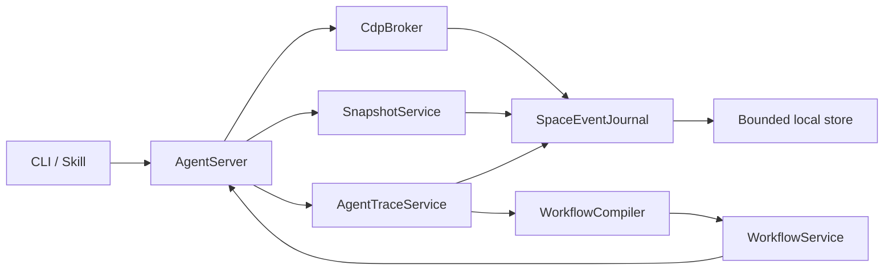

# UFO-Browser Agent Efficiency P0

## 1. 目标

本阶段不是继续增加零散浏览器命令，而是在现有 UFO-Browser Agent 链路上建立一套可观测、低上下文、可复用的执行系统：

1. 每个 Agent 动作都有可查询的 Trace。
2. 页面未发生大范围变化时，只向 Agent 返回增量 Snapshot。
3. 成功流程可以保存为带断言和变量的本地 Workflow，并在无 LLM 的情况下重放。
4. CLI 退出或重新连接后，仍可读取 Space 之前产生的网络、Console、生命周期和动作事件。

预期效果：减少 Agent 无效等待、重复观察、重复推理和恢复轮次，同时让卡顿、误点、页面异常和资源释放问题具备完整证据链。

## 2. 不可破坏的现有契约

- 继续使用当前 Electron/Chromium，不引入第二套浏览器引擎或外部 Chrome Controller。
- `PresentationCoordinator` 继续是前台显示状态的唯一来源。
- `TaskSpaceManager` 继续拥有 Space、Tab、页面 View 和生命周期。
- Agent 仍只通过当前用户 Unix Socket、Space ownership/lease 和进程内 CDP 操作页面。
- 后台 Agent 操作不得显示或聚焦 App、切换用户当前 Space、移动系统鼠标。
- Trace、事件记录、Workflow 录制不得把后台页面 attach 到主窗口。
- Agent 控制遮罩属于 App，不得进入网页 DOM、页面截图或 Snapshot。
- 新能力必须保持现有 Ego-compatible helper 行为，旧调用不需要修改。
- 默认不能持续录制高清视频，不能为了 Trace 持续唤醒 compositor。
- 密码、Cookie、Authorization、Token 和敏感表单值不得进入日志、Trace、Snapshot 差异或 Workflow 文件。

## 3. 总体架构



新增状态必须有明确唯一所有者：

| 状态 | 所有者 | 生命周期 |
| --- | --- | --- |
| Space 有序事件、sequence、游标 | `SpaceEventJournal` | Space 生命周期，可按策略保留有限历史 |
| Agent action step、动作结果、截图索引 | `AgentTraceService` | 一次任务或一次录制 |
| Snapshot revision 和增量基线 | `SnapshotService` | Tab 生命周期，继续使用有界内存 cache |
| Workflow 定义、版本、成功率 | `WorkflowService` | 本地持久化，独立于 Space |

这些 service 不拥有 Presentation、WebContents、lease 或 Profile，不复制对应状态。

## 4. P0-A：Agent Trace

### 4.1 行为

所有公共 Agent 动作在进入实际执行层时创建 `stepId`，成功、失败、超时或连接终止时关闭该步骤。

记录内容：

- Space、Tab、connection 和 lease generation。
- action 名称、用户提供的动作 label。
- 目标的 ref、稳定 locator、role、accessible name 和必要的父级语义。
- 起止 URL、起止时间、总耗时和浏览器执行耗时。
- Locator 解析、自恢复、actionability、点击遮挡和重试摘要。
- 导航、Popup、Dialog、Download、Renderer crash 等相关事件。
- 错误类型和可供 Agent 决策的结构化原因。
- 失败、导航和明确标记的关键步骤可保存截图；普通成功步骤默认不截图。

示例事件：

```json
{
  "sequence": 1208,
  "stepId": 18,
  "spaceId": 7,
  "tabId": "A1B2",
  "type": "action.finished",
  "action": "click",
  "target": {
    "role": "button",
    "name": "Create Account",
    "locator": "role:button[name=Create Account]"
  },
  "beforeUrl": "https://janitorai.com/register",
  "afterUrl": "https://janitorai.com/verify",
  "durationMs": 842,
  "status": "success"
}
```

### 4.2 API

```js
await taskSpaces.trace.list(spaceId, {
  after: 0,
  limit: 200,
  status: "failed"
})

await taskSpaces.trace.export(spaceId, {
  format: "markdown", // json | zip
  path: "/absolute/path"
})
```

旧 helper 不要求显式开启 Trace。默认记录轻量结构化动作，截图和详细网络信息按策略启用。

### 4.3 UI

Overview Space 卡片只显示简短状态；详细时间线进入 Space 的任务记录面板查看。每行显示动作、目标、耗时、结果和错误。点击带截图的步骤可以查看当时页面，但不能让历史记录改变当前 Presentation。

### 4.4 性能与隐私

- 结构化事件写入不能阻塞点击、输入和导航主路径。
- 使用有界异步队列，App 退出时执行有上限的 flush。
- 默认不保存 Response body、Cookie、完整请求 Header 或表单明文。
- 对 password、OTP、Authorization、Cookie、Set-Cookie、Token 类字段统一脱敏。
- 截图失败不能使原动作失败。
- Trace 不能开启持续 screencast 或改变 background throttling。

## 5. P0-B：持久 Space 事件流

### 5.1 行为

在 App 主进程为每个 Space 保存单调递增的事件序列。CLI 断开、下一轮 heredoc 或 Agent 进程重启后，可以从上一个 sequence 继续读取。

事件分类：

- `action`
- `navigation`
- `network`
- `console`
- `dialog`
- `download`
- `lifecycle`
- `trace`

### 5.2 API

```js
const events = await taskSpaces.events.list(spaceId, {
  after: 1200,
  categories: ["network", "console", "lifecycle"],
  limit: 200
})

const cursor = events.nextSequence
```

后续可以增加异步 follow，但第一版先实现有游标的 list/poll，避免引入长连接复杂度。

### 5.3 保留策略

- 每个 Space 内存事件有固定上限，旧事件按 sequence 淘汰。
- 磁盘只保存最近有限时间和有限容量，原子写入。
- Temporary Profile Space 关闭时默认清除事件和截图。
- 持久 Profile Space 的事件保留策略可配置，但不能保存页面凭据。
- App 重启后 sequence 不得倒退；历史已淘汰时返回明确的 `cursorExpired`。

## 6. P0-C：Snapshot V2

### 6.1 API

保持现有 `snapshotText()` 默认行为，新增可选能力：

```js
const initial = await snapshotText({
  interactive: true,
  compact: true,
  depth: 6,
  selector: "#register-form",
  urls: true,
  boxes: true
})

const delta = await snapshotText({
  sinceRevision: initial.revision
})
```

建议结构化 facade 同时提供对象结果：

```js
const snapshot = await page.snapshot({
  format: "structured",
  interactive: true,
  compact: true,
  sinceRevision
})
```

Ego-compatible `snapshotText()` 仍可返回文本；结构化结果不能破坏旧格式。

### 6.2 增量结果

```text
revision: 153 -> 154

changed:
- button "Send code"
+ button "Code sent" [disabled]

added:
+ dialog "Enter verification code"
+ textbox "Digit 1" [ref=81]
+ textbox "Digit 2" [ref=82]
```

### 6.3 Ref 稳定性

- 同一 DOM node 在 full、compact、interactive、selector 和 depth 视图中必须保持相同 ref。
- Ref 身份优先基于 CDP backend node identity 和现有 App 侧 ref history，而不是输出行号。
- DOM 替换后继续使用现有唯一 stable locator 恢复规则；多匹配时禁止猜测。
- 页面大范围导航、基线丢失、iframe/shadow 覆盖不完整或 diff 过大时自动回退 full snapshot，并说明原因。

### 6.4 性能边界

- Diff 计算必须复用现有 revision cache，不能每次为了确认无变化重新抓完整 AX/DOM tree。
- Cache 继续有界，不落盘，不跨 App 重启保存 DOM 内容。
- `boxes` 只在明确请求时计算。
- selector/depth/interactive 过滤不能执行不受控页面脚本。

## 7. P0-D：Workflow Recorder 与 Replay

### 7.1 原则

Workflow 不是坐标宏，也不在 UFO 内嵌新的 LLM。它由一次成功 Trace 编译成确定性 Recipe，正常步骤无模型重放，失败时停止并把精简恢复上下文交回外部 Agent。

### 7.2 API

```js
const recording = await workflows.start("janitor-register")

// Agent 使用现有 helper 正常完成流程。

await recording.finish({
  variables: ["email", "username"],
  secrets: ["password"]
})

await workflows.replay("janitor-register", {
  email: "new@example.com",
  username: "victor",
  password: secret("janitor-test-password")
})
```

第一版可以先支持显式 `workflows.start/finish`，不要自动把所有成功任务保存为 Workflow。

### 7.3 Recipe 内容

每一步包含：

- 动作类型和变量槽。
- 稳定 locator、role/name、父级关系和必要的 nth 信息。
- 前置条件和完成断言。
- 导航、Popup、Dialog 和 Download 等等待条件。
- 超时和允许的有限恢复策略。
- 是否属于敏感输入或不可逆动作。

示例：

```yaml
name: janitor-register
version: 1
steps:
  - goto: https://janitorai.com/register
    assert:
      urlContains: /register
  - fill:
      locator: role:textbox[name="Email"]
      value: ${email}
  - secretFill:
      locator: role:textbox[name="Password"]
      secret: ${password}
  - click:
      locator: role:button[name="Create Account"]
    assert:
      any:
        - dialogVisible: Verification
        - urlContains: /verify
```

### 7.4 失败恢复

按照以下顺序尝试有限确定性恢复：

1. 原 stable locator。
2. role + accessible name。
3. 录制的父级、Label 和相邻语义。
4. 现有唯一 locator self-heal。
5. 停止重放，不猜测点击。

停止时返回：失败步骤、预期元素、当前候选、Snapshot delta、相关网络/Console 事件和必要截图。外部 Agent 修复成功后，可以显式保存为 Workflow 新版本。

### 7.5 高风险动作

支付、发送、发布、删除、预约、修改账号或其他难撤销动作默认不能自动越过最终提交。Recipe 必须标记风险步骤，并在重放时返回 `waitingApproval`。强制自动提交必须由调用方显式配置并受域名/动作策略约束，不能由录制结果自行推断授权。

### 7.6 Action Cache

每个有目标元素的 Recipe step 持久化最近一次成功且唯一的定位策略。Replay 先尝试 Action Cache；缓存目标缺失、多匹配或不可见时，在动作发出前失效并进入原有有限语义恢复链。回退成功后原子替换缓存。Recipe 统计 `hits`、`misses`、`fallbacks`、`updates`，输入值、密码、OTP、Token 和 Cookie 永不进入缓存。`{ actionCache: false }` 只用于诊断，既不读取也不更新缓存。

## 8. P0-E：Profile-aware Browser Request

`page.request` / `fetch.profile` 由 App 主进程使用当前 Space 的 Electron `Session.fetch()` 发起请求，不经过 renderer，不受页面 CORS 影响。它默认携带并写回该 Profile Cookie，同时复用 Chromium Session 已配置的代理、UA、语言和 Client Hints。Temporary Space 继续使用一 Space 一内存 Session，不能跨 Space 观察 Cookie。

请求必须通过现有 ownership/generation lease。只允许 HTTP(S)，限制 URL、Header、请求体、响应体和超时；Chromium 身份与传输 Header 不能覆盖，重定向使用已验证的原生 `follow/error` 模式。事件只保存 method、origin、脱敏 path、status、duration 和 bytes，不保存 Header 值、Authorization、Cookie、请求体、响应体或 `Set-Cookie`。

## 9. 典型场景

以 Janitor 注册为例：

1. 首次 Snapshot 返回注册表单。
2. Agent 填写邮箱后，增量 Snapshot 只返回校验状态变化。
3. 点击提交如果被遮挡，Trace 立即记录遮挡元素和等待时间。
4. 接口返回 429 时，下一轮 CLI 仍能从 Space 事件流读到失败请求和 `Retry-After`。
5. OTP Dialog 出现后，Snapshot delta 只返回六个输入框及稳定 ref。
6. 流程成功后保存为 Workflow。
7. 下次传入新变量直接重放；页面未变化时不再调用 LLM 重新理解每一步。
8. 若按钮改名，Workflow 在该步骤停止并返回候选和页面差异，不继续盲点。

## 10. 实现阶段

### Phase 1：事件与 Trace 底座

- 实现 `SpaceEventJournal` 和 sequence/cursor。
- 在 AgentServer、CdpBroker、TaskSpaceManager 生命周期入口发布结构化事件。
- 实现 `AgentTraceService`、脱敏、容量限制、导出。
- 增加 CLI/API、help、Skill 和 UI 时间线的最小版本。

### Phase 2：Snapshot V2

- 定义兼容的 Snapshot options/result contract。
- 实现 compact/interactive/depth/selector。
- 实现稳定 ref 和 revision delta/full fallback。
- 增加 token、延迟、超大页面、iframe 和 DOM replacement 回归测试。

### Phase 3：Workflow

- 实现显式录制、Recipe schema、存储和版本。
- 从成功 Trace 编译稳定步骤、变量、等待和断言。
- 实现 replay、有限 self-heal、失败恢复包和高风险确认。
- 对接现有 learned site tools，但不替换或复制它们。

## 11. 验收门禁

### 正确性

- 旧 `snapshotText()`、click/fill/goto、ownership/lease 调用全部保持兼容。
- 两个并行 Space 的 Trace、事件、ref 和 Workflow 运行严格隔离。
- CLI 断开并重连后可以从游标继续读取事件。
- Snapshot delta 的 ref 与 full snapshot 一致。
- Workflow locator 多匹配时停止，不按第一个候选猜测。
- Space 被关闭、Tab 被销毁、App 退出时不抛出 `Object has been destroyed`。

### 性能

- 未开启详细 Trace 时，普通点击/输入新增延迟不可感知。
- 空闲 Space 不因 Trace 或事件流唤醒 compositor。
- 事件和 Snapshot cache 均有可测量的容量上限。
- 动态页面使用 delta 后，返回文本和 Snapshot 耗时相对 full snapshot 明显下降。
- 默认不持续录屏，GPU 空闲行为与当前版本一致。

### 安全

- 自动测试证明密码、OTP、Cookie、Authorization 和 Token 不会写入 Trace、事件文件或 Workflow。
- Temporary Space 清理时删除对应的 Trace 截图和事件历史。
- Workflow 高风险最终提交默认要求确认。
- 导出文件使用明确路径和当前用户权限，不创建公网入口。

### 建议新增验证命令

```bash
npm run verify:agent-trace
npm run verify:space-event-journal
npm run verify:snapshot-delta
npm run verify:workflow-replay
npm run verify:agent-data-redaction
npm run verify:agent-efficiency
```

`verify:agent-efficiency` 应使用固定动态页面 Fixture 对比 full snapshot 与 delta 的字节数、耗时、动作轮数和 Workflow 第二次运行是否零 LLM。

## 12. 非目标

- 不切换 CEF、Chromium fork 或无头浏览器内核。
- 不内置另一套 LLM Agent planner。
- 不默认保存密码、支付信息或完整 Cookie。
- 不默认持续录制视频。
- 不在本阶段实现云端代理池、CAPTCHA 服务、Memory、周期任务或完整 Skill Gallery。
- 不为了时间线新增第二份 Space/Presentation 状态。
