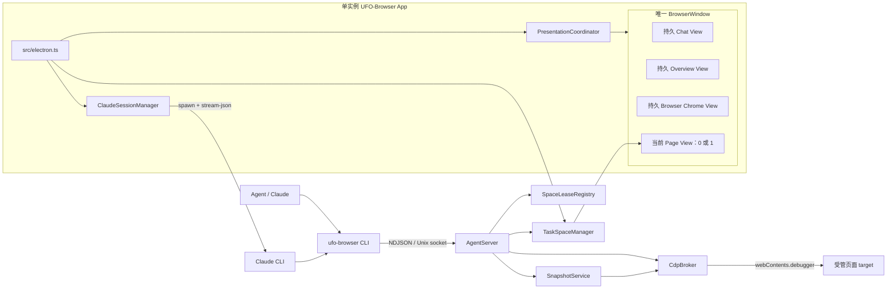
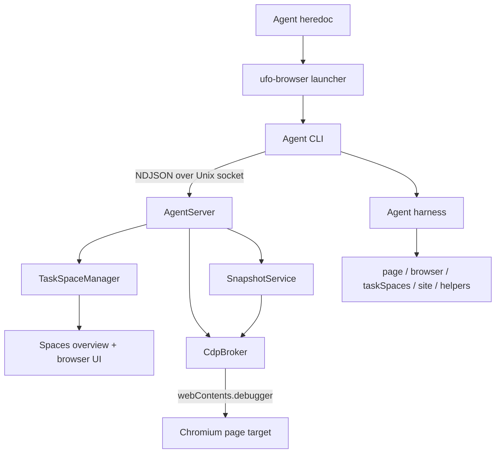
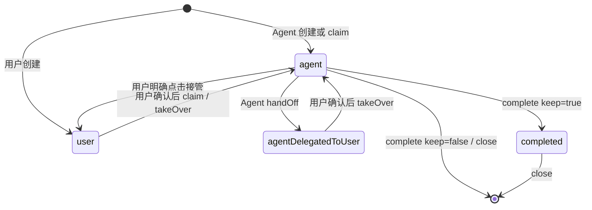

1:

---

# UFO-Browser 当前核心架构与开发指南

> 本文只保留开发时必须理解的系统模型、不可破坏契约、代码入口和验证门禁。Electron、TypeScript、HTML/CSS、CDP 基础等通用知识不展开。
>

## 1. 不可破坏的核心约束

1. **一个 App、一个 macOS 主窗口、多个 Task Space。** Space 是窗口内任务容器，不是新的系统窗口。
2. **继续使用当前 Electron/Chromium 内核。** 不切换外部 Chrome controller，不 fork Chromium，不引入第二套浏览器引擎。
3. **Chat、Overview、Browser Chrome 是长期存在的 shell `WebContentsView`。** 普通切换、最小化、恢复和侧栏 resize 不重复 `loadFile()`。
4. **`PresentationCoordinator` 是前台展示状态的唯一来源。** 不新增第二份 `visibleSpaceId`、route 或“当前 Space”状态。
5. **Overview 中页面 View 恒为 0；Space 模式只能 attach 1 个用户明确打开的页面 View。** 后台 Agent、截图和预览不能进入主窗口。
6. **Agent 选择与操作永远后台化。** `useTaskSpace()`、建 Tab、CDP、截图不能显示/聚焦 App、改变用户当前界面、切换 macOS Space 或移动系统鼠标。
7. **ownership 与 lease 分离。** ownership 可持久化；lease 只属于一个活跃 socket，并用 generation 阻止过期命令。
8. **只允许显式接管。** 点击网页、滚动或碰触浏览器控件不会转移控制；只有“接管”和“终止任务”改变状态。
9. **Agent 只走本地 Unix socket 与进程内 `webContents.debugger`。** 不开放远程调试端口，不使用 `-enable-automation`，不使用 OS 鼠标键盘兜底。
10. **Chrome 导入先事务复制到独立 UFO-Browser Profile，再由用户按 Profile 显式开启增量同步。** 不修改源 Chrome；首次开启只建立非破坏基线，后续仅更新源端变化，UFO 端登出或冲突永远优先保留。
11. **Overview 预览有界、内存态、不可交互。** 不落盘，不在启动时唤醒全部 Space，不改变 Presentation。
12. **左侧 Claude 工作台复用同一 Agent 链路。** 它不能直接控制 page debugger，也不能成为第二套 ownership/lease 系统。
13. **迭代只用隔离测试 App。** 完整验证后，只有用户再次明确要求替换，才能覆盖 `/Applications/UFO-Browser.app`。

修改这些契约前必须阅读：

- `.codex/skills/ufo-browser-development/SKILL.md`
- `.codex/skills/ufo-browser-development/references/protected-contracts.md`

契约变更必须先向用户说明当前行为、拟议行为、影响、回滚和测试，获得明确确认后再改代码。

## 2. 运行时拓扑与状态所有权



### 2.1 唯一所有者

| 状态或对象 | 唯一所有者 | 说明 |
| --- | --- | --- |
| 当前显示 Overview 或某个 Space | `PresentationCoordinator` | 串行事务、generation、last-request-wins、失败回滚 |
| Space、Tab、Profile、页面 View、预览 | `TaskSpaceManager` | 页面生命周期和真实 mutation queue |
| 每个 socket 当前选择的 Space | `AgentServer` connection context | 连接间隔离，不能放进 Manager 全局状态 |
| `spaceId → connectionId + generation` | `SpaceLeaseRegistry` | 同一 Space 同时只有一个 Agent 控制 |
| synthetic CDP session | `CdpBroker` | 连接、Space、Tab、debugger 事件路由 |
| snapshot ref map | 每个短命 harness runtime | 不持久化，不保证跨页面上下文有效 |
| Chat 会话、流式事件、CLI 子进程 | `ClaudeSessionManager` | Renderer 只显示状态并发送受限动作 |
| 可恢复浏览器元数据 | `BrowserStateStore` | `browser-state.json` 原子写入，不保存 Electron 对象 |

新增功能前先确定状态属于哪一行。不要在 Renderer、`electron.ts` 或另一个 service 中复制同一份可变状态。

### 2.2 启动顺序

```
单实例锁
  → 确定 userData、同步受管能力
  → 初始化 Profile Registry，并在任何相关 session.fromPartition 前清理待删除 partition、恢复未完成导入 job
  → 创建隐藏 BrowserWindow 和三个持久 shell
  → 初始化 Store、TaskSpaceManager、Profile Session 与浏览器服务
  → 创建 Broker、Snapshot、Presentation、AgentServer、ClaudeSessionManager
  → 加载 shell 并提交初始 Overview
  → 最后监听 Unix socket
```

关键点：窗口在初始 shell/presentation 就绪前不显示；socket 最后启动；正常路径只运行一个实例，不使用 `open -n`。

主要持久位置：

```
~/Library/Application Support/UFO-Browser/
├── browser-state.json / browser-library.json / downloads.json / profiles.json
├── site-permissions/*.json
├── Chrome Import/
├── Partitions/
├── Claude Chat/index.json
├── Claude Chat/conversations/*.jsonl.enc
├── Assistant Workspace/
└── ufo-browser.sock
```

## 3. 单窗口 Presentation、View 栈与页面坐标

`src/main/presentation-coordinator.ts` 只允许：

```tsx
type Presentation =
  | { kind: "overview" }
  | { kind: "space"; spaceId: number };
```

Chat 是窗口布局，不是第三种 Presentation。

一次切换分为：

```
prepare：hydrate 目标并计算布局，不改变用户当前画面
commit：attach/detach、调整 z-order/bounds，最后发布状态
rollback：commit 失败时恢复真实可见状态
generation：跳过尚未开始的旧请求，只执行最后请求
```

主窗口 View 不变量：

```
Overview：Chat + Overview；Page View = 0
Space：Chat + Browser Chrome + 当前页面；Page View = 1
后台 Agent Space：页面继续运行，但不属于主窗口 View 树
```

### 3.1 页面布局规则

- 前台页面填满聊天栏右侧、Browser Chrome 下方的真实可用区域，`zoomFactor = 1`。
- Chat width 是主窗口布局状态；主进程先更新内存 bounds，再异步持久化，避免左右区域出现延迟空白条。
- Renderer 上报相对页面矩形时必须绑定当时的 native content 尺寸；尺寸已变化就回退到主进程计算的完整页面矩形。
- 最小化时拒绝 0/1 像素 bounds，恢复时主动重新布局。
- Library 是覆盖层，不通过持续缩放真实页面 View 展示。
- 页面从隐藏 capture surface 迁入主窗口前先写最终 bounds；每次 reparent 带 View generation，旧预览任务不能把旧坐标或 `{x:0,y:0}` 写回前台。
- Overview/Browser/Chat renderer 只有崩溃恢复时才可重建；正常切换不得重新加载。
- 窗口拖动同时保留 CSS drag region 和 renderer→main 原生 fallback，不能只留其中一种。

核心入口：

- `src/main/presentation-coordinator.ts`
- `src/main/shell-page-bounds.ts`
- `src/main/space-viewport.ts`
- `src/main/window-visibility.ts`
- `src/renderer/window-drag.ts`
- `src/electron.ts`

## 4. Task Space、Profile、ownership 与 lease

Space 运行时记录包括 id/name、createdBy、ownership、lifecycle、profileId、`profileMode`、可选 `sessionScopeId`、Agent 状态、Tab 元数据和活动 Tab。

持久化：仅持久 Profile Space 的 Space、Tab URL/标题、Profile、ownership、lifecycle。临时 Profile Space 在 Store 边界统一过滤，App 重启不恢复。

不持久化：`WebContentsView`、debugger、CDP session、socket、lease、预览任务和 Renderer 对象。

同一持久 Profile 的 Space 共享 Cookie 与站点存储；标签组、活动 Tab、任务状态和控制权彼此隔离。内置 `temporary` Profile 是虚拟模板，不写入 `profiles.json`，也不能替换持久默认 Profile；每次由人或 Agent 选择它都会生成唯一 UUID scope 和不带 `persist:` 的内存 Session，Cookie、LocalStorage、IndexedDB、Service Worker、缓存、权限与认证状态均不共享。关闭 Space 后清理整个 Session。

新 Space/Tab 的默认 URL 由 `src/main/internal-pages.ts` 的 `X_BROWSER_DEFAULT_NEW_TAB_URL` 统一定义，当前直接指向真实 `https://www.google.com/`。UFO-Browser 不再打包或加载本地仿制 `newtab.html`；Google 的地区重定向仍被识别为初始页，Agent 首次导航可以复用同一 target。旧状态中的 `x-browser://newtab/` 或物理 `newtab.html` URL 只作为迁移输入，加载时直接转到真实 Google。用户输入普通文本和网址时仍按 Google 搜索/HTTPS 地址导航。不要在调用点散落 `about:blank`、构建目录的 `file://` 地址或另一份首页常量。

### 4.1 ownership 与 lease

- ownership 是产品层的持久控制状态；lease 是活跃连接的运行时执行权。
- 一个连接一次只选择并持有一个 Space lease。
- `useTaskSpace()` 只有“选择”语义，不显示 Space，也不隐式抢 ownership。真正由用户创建的 Space 使用 `claimTaskSpace()`；Agent handoff 或被用户接管后的原 Agent Space，只有用户明确确认继续后才使用 `takeOverTaskSpace()`。
- 不同连接可以并行控制不同 Space；同一 Space 冲突返回 `EGO_TASK_SPACE_UNAVAILABLE`。
- 每个 socket 有顺序 Promise 队列，保证 `useTaskSpace → createTab/snapshot/CDP` 按接收顺序执行。
- 连接断开、接管、handoff、complete、error、close 都释放 lease。
- generation 在 RPC 入口、Manager mutation queue 和 debugger 真正发送前都要检查。
- 关闭 Space 必须同步清理 selection、lease、synthetic session、下载、预览、页面 View 和持久记录。

### 4.2 用户动作的精确语义

| 动作 | ownership / lease | Presentation | 页面结果 |
| --- | --- | --- | --- |
| **Spaces** | 不变 | 返回 Overview | Agent 页面继续后台运行 |
| **接管** | ownership→user，撤销 lease | 保持当前 Space | 解除遮罩和 Browser Chrome 锁定 |
| **终止任务** | lifecycle→completed，撤销 lease | 保持当前 Space | 解锁页面和浏览器控件，不关闭 Space |
| Agent handoff | ownership→agentDelegatedToUser | 不主动抢前台 | 等待用户处理 |
| complete/error/close | 按状态机清理 | 后台不影响当前界面；关闭可见 Space 才回 Overview | 清除遮罩及关联运行时状态 |

硬停止错误：

- `EGO_TASK_SPACE_USER_IN_CONTROL`：用户已接管，不自动重试。
- `EGO_TASK_SPACE_INACTIVE`：任务 completed/error 或不可执行。
- `EGO_TASK_SPACE_UNAVAILABLE`：lease 冲突、丢失或 generation 失效。

核心入口：`src/main/manager.ts`、`task-space.ts`、`agent-server.ts`、`space-lease.ts`、`state-store.ts`。

## 5. Agent CLI、CDP、输入与 Snapshot

### 5.1 调用链

```
Agent JavaScript
  → 短命 ufo-browser CLI
  → 本地 Unix socket
  → AgentServer 选择 Space 并获取 lease
  → CdpBroker synthetic session
  → 目标 webContents.debugger
```

CLI 每轮退出，但 App、Profile、页面和 Space 继续存在。跨轮次保留 Space 数字 id 或稳定 locator，不依赖上一轮局部变量。

### 5.2 synthetic CDP session

Electron debugger 已绑定具体 `webContents`，而 harness 使用浏览器级 `Target.attachToTarget({flatten:true})`。Broker 因此维护：

```
sessionId → connection → lease generation → Space → Tab
```

Tab、Space、lease、连接或执行上下文失效时必须清理映射。`Target.activateTarget`、`Target.closeTarget`、下载、文件选择、截图及可能显示/聚焦窗口的命令不能直接透传。

下载由 Broker 登记 CDP download behavior，Electron Session 的 `will-download` 决定真实路径，再向所属连接合成 `Page.downloadWillBegin` / `Page.downloadProgress`。相关实现：`src/main/download-registry.ts`。

`window.open()`、`target=_blank` 和命名 popup 作为同一 Space 的 managed Tab 接管，保留 `WindowProxy`、`window.opener`、`postMessage`、命名窗口复用和 close/closed 语义；后台 popup 不创建第二个产品窗口或切换前台。

### 5.3 输入与接管遮罩

页面点击、拖动、滚轮和键盘必须使用目标 debugger 的 `Input.*`：

- 不移动或点击系统鼠标；
- 不为输入显示、聚焦或 attach 后台页面到主窗口；
- 不退化成 Electron `sendInputEvent`，否则跨进程 iframe/Turnstile 可能坐标正确但不命中。

当 Space 为 `active + ownership=agent`：

- 网页 document-start 在站点脚本前安装 closed-shadow 遮罩，并在被删除或隐藏时自愈；
- 页面遮罩只绘制一套“接管/终止任务”栏；Browser Shell 只锁 Chrome 并保留 Spaces；
- 页面、地址栏、历史、刷新、Tab 与新建按钮全部锁定；
- 普通用户输入不改变 ownership；
- 短命 CLI 退出不会自动移除遮罩。

### 5.4 Snapshot、ref 与 revision cache

`SnapshotService` 使用 AX tree 生成语义文本和真实 `backendNodeId`，Agent ref 为 `@N`。

- 每次 snapshot 重建 ref map。
- 导航、执行上下文销毁、切 Space/Tab、创建/关闭 Tab 都使旧 ref 失效。
- generation fence 阻止旧 snapshot 回填新页面。
- 跨轮次优先 `loc=href:`、`loc=role:`、`loc=css:`、XPath 或稳定 CSS。
- 内存 revision cache 最多覆盖 24 个标签，revision 来自 DOM、URL/readyState、表单值和 viewport scroll。
- UFO-Browser 自己的遮罩变化不应使页面 snapshot 失效；iframe 和页面自有 shadow tree 保持保守 uncached 路径。
- cache 不落盘、不跨 App 重启，返回前复制 refs。

公共 Agent API 变化必须同步 binding、AgentServer、CLI、harness `helperContext()`/JSDoc/`help()`、`docs/agent-cli.md`、README 与 `skills/ufo-browser/SKILL.md`。

## 6. Overview 低频动态预览

```
可见卡片 ids
  → TaskSpaceManager 有界调度
  → 浏览器页面区域大小的透明 capture BaseWindow
  → 所有可见 Space 统一使用错峰 JPEG capture
  → 画面变化才发布；静态卡片逐级退避
  → binary IPC
  → 每张卡片的持久 Canvas 增量绘制
```

必须保持：

- Overview 主窗口中的 Page View 恒为 0。
- `IntersectionObserver` 只负责触发；发布时重新按卡片 DOM rect 计算真正可见项，最多 8 个。
- capture surface 与真实浏览器页面区域同尺寸、同屏幕位置，`opacity:0`、不可聚焦、忽略鼠标、Mission Control 隐藏；没有 child View 时立即隐藏。
- Overview 连续 screencast 当前必须保持关闭；所有可见卡片统一走低频截图队列。已有首帧后，每个 Space 共用一个全局 4 秒截图硬下限（实际约 0.25 FPS，产品体感目标约 0.2 FPS），iframe、视频、广告和统计 frame 的加载/导航不能绕过；连续无变化时进一步退避到 6 秒、8 秒。导航与 Agent 活动仍可标记画面为 dirty，但只能在全局窗口允许时合并补一帧；只有首次预览和没有可用帧的恢复流程允许快速重试。
- 主页面导航、Agent 进度与 Agent 操作结束只作为 dirty 提示，在该 Space 的全局截图窗口允许时合并唤醒一次有界截图；子 frame/全局 loading spinner 噪声不参与调度，任何提示都不能绕过 capture 并发或开启连续订阅。
- 图片约 480px、JPEG quality 70；这些是可测量调参，不是产品契约。
- 帧只在内存中，通过二进制 IPC 进入持久 Canvas；新帧解码完成前保留旧帧，只保留一个最新 pending frame。
- 启动只 hydrate 当前可见缺图卡片；不可见 Space 不被总览批量唤醒，preview-only renderer 捕获后释放。
- 冷启动、运行中新建、删除全部后重建、首次 capture 失败都进入有界 hydration/self-heal。
- 重复上报相同可见集合不能取消或不断推迟已排队的首次截图；持续缺图的可见卡片进行低频恢复。
- 初始 viewport 尚未收敛时使用真实 native bounds，不能生成 `1×1` 缩略图；近乎纯色首帧做有限重试。
- Overview 隐藏、App 最小化、卡片离屏、Space 结束或 Agent 自己录屏时停流并释放挂载。
- Agent screencast 与 Manager 截图互斥，Broker 负责 suspend/resume，Manager 帧不能泄漏给 Agent；恢复后立即补一次低频截图。

核心入口：`src/main/manager.ts`、`preview-visibility.ts`、`src/renderer/overview/`。

## 7. Profile 导入与 Chromium/OOPIF 兼容

### 7.1 Chrome Profile 导入

```
检测 Chrome Stable Profile
  → 用户确认后请求 Chrome 正常退出
  → allowlist 复制到受保护 staging
  → 激活到全新 UFO partition
  → Worker 请求 Keychain 并解析/解密 Cookie
  → Electron API 写普通 Cookie，同 partition CDP 写 CHIPS
  → flush 后按 Cookie 属性逐项验证
  → 原子发布 Profile Registry；失败冷启动清理
```

核心契约：不修改源 Chrome，不覆盖现有 UFO Profile；初次导入是独立事务快照，持续同步必须按 Profile 显式开启且先建立非破坏基线；session Cookie 转为导入日起 30 天；源未变化时绝不恢复 UFO 内的登出，双方变化时保留 UFO；密码、支付资料、Chrome 账号、历史、书签、扩展、窗口、标签页、Session Storage 与设备绑定凭据不在范围内。完整实现与验收见 `docs/chrome-login-import.md`。

### 7.2 Chromium/Turnstile 兼容

- 同时设置全局 `app.userAgentFallback` 和每个 Profile Session 的 reduced Chromium UA；Session UA 单独不能覆盖跨站 OOPIF。
- 保持原生 `navigator.userAgentData`、locale 和 languages。
- 不增加页面级 `Network.setUserAgentOverride`，尤其不修改 `acceptLanguage`。
- 低熵 Client Hints 必须与 UAData 对齐；当前主动补齐 hook 只注册 `https://*/*`，localhost 依赖 Chromium 原生行为，不要在文档或测试中假设它也走同一 hook。
- 网页 preload 只补 `window.chrome.loadTimes/csi/app`，不暴露 Node、Electron IPC 或 Agent API。
- `navigator.webdriver` 保持 false，不增加自动化启动参数或异常全局。
- Turnstile 的可信点击必须通过原始 page debugger `Input.*`；DOM 状态不能替代真实人工/Agent 点击回归。

核心入口：`src/main/chrome-import/`、`src/main/profile-registry.ts`、`src/main/chromium-identity.ts`、`src/electron.ts`。

## 8. 左侧 Claude 工作台与受管能力

```
Chat renderer
  → Chat preload
  → ClaudeSessionManager
  → Claude CLI stream-json
  → 受管 ufo-browser / xemail Skill 与 CLI
  → 现有 Agent socket
```

- Chat 是独立持久 View，跨 Presentation 保留会话、草稿、滚动和流式状态。
- `ClaudeSessionManager` 持有会话、进程、resume id、workspace 校验与加密存储。
- 当前可运行 provider 是 `claude`；`codex` 只是 registry 预留项，不另建 UI/状态系统。
- Browser Agent 使用 App 管理的 Assistant Workspace 和严格空 MCP 配置，避免用户配置引入第二套浏览器控制路径。
- Tool 调用按稳定 `toolUseId` 更新同一 transcript message；Assistant streaming 与最终事件复用 message id，进程结束必须收口 pending 状态，避免重复对话和永久光标。
- 历史会话使用 `-resume claudeSessionId` 恢复模型记忆。
- transcript 写盘前加密，Tool 输入/结果进入 Renderer 前脱敏。
- App bundle manifest 是受管能力 source of truth；只更新带 UFO-Browser 管理标记的 Skill/CLI，保留用户自有同名内容。
- Chat 发出的浏览器操作继续遵守 ownership、lease、后台不聚焦与显式接管。

核心入口：`src/main/claude-chat/`、`src/main/assistant-capabilities.ts`、`src/renderer/chat/`、`scripts/build-assistant-bundle.mjs`。

## 9. IPC 与安全边界

Renderer 只能通过 `src/preload/contracts.ts` 和 `src/preload/bridge.ts` 的类型化白名单调用 `x-browser:*` channel。

新增 IPC：先定义 contract，再在 bridge 清洗输入，随后在 `electron.ts` 注册并校验可信 sender，最后补正常/错误/竞争测试。

安全底线：

- 页面与三个 shell renderer 保持 context isolation；网页无 Node integration。
- 不暴露通用 `ipcRenderer.send`、文件系统、`eval` 或任意进程启动接口。
- socket、状态文件和导入 pending 文件使用当前用户权限。
- Profile、Cookie、下载、权限、文件路径和 Agent 连接按 Session/Space/connection 隔离。
- 后台 Agent 不触发会抢前台的原生认证、证书、权限或文件选择 UI。
- 运行时只执行 App bundle 中经过 manifest/hash 校验的受管能力，不从开发 workspace 或网络加载未校验代码。

## 10. 修改入口与回归门禁

| 修改目标 | 首先阅读 | 必跑门禁 |
| --- | --- | --- |
| 启动、单实例、最小化恢复、退出 | `electron.ts`、`window-visibility.ts`、Presentation | `npm run verify:window-lifecycle`、`npm run verify:app-quit` |
| 页面 bounds、Chat/Library 布局 | `shell-page-bounds.ts`、`space-viewport.ts`、Browser renderer | `npm run verify:page-layout` |
| Space/Tab/Profile | `manager.ts`、`task-space.ts`、`state-store.ts` | 相邻 unit tests |
| 多 Agent/lease/CDP 顺序 | `agent-server.ts`、`space-lease.ts`、`cdp-broker.ts` | `npm run verify:multi-agent` |
| 接管、遮罩、可信输入 | overlay、Browser renderer、Broker | explicit takeover / input isolation tests |
| Preview/capture | `manager.ts`、Overview renderer | `npm run verify:preview` |
| Snapshot/ref/locator | `snapshot.ts`、harness resolver/ref files | snapshot 与 harness tests |
| Popup/download | `manager.ts`、`cdp-broker.ts`、`download-registry.ts` | popup/download tests |
| Chrome 导入 | import files 与专项文档 | `npm run verify:chrome-import` |
| UA/OOPIF/Turnstile | compat files、Broker | compat/OOPIF tests +真实点击回归 |
| Chat/能力包 | Claude manager、Chat renderer、capability installer | Chat/layout/capability tests |
| 公共 Agent API | binding、AgentServer、CLI、harness、Skill | harness tests + 打包后真实浏览器 E2E |
| 打包、Skill 分发、安装 | `scripts/`、`docs/macos-build.md` | `dist:mac`、`package:mac:test`、`package:mac`、smoke |

### 10.1 标准开发流程

1. `git status --short --branch`，保留所有无关改动，不 reset/clean/覆盖。
2. 阅读真实代码、最近测试、`docs/architecture.md`、开发 Skill 和 protected contracts。
3. 复现问题并保留可观察证据；优先增加失败回归。
4. 在状态唯一所有层修改；使用事务、串行队列、generation fence、有界并发和增量 Renderer 更新。
5. 跑覆盖本问题的最小确定性门禁，再执行 `git diff --check`。
6. 每个独立问题形成一个 commit；测试通过后推送当前分支到 `https://github.com/VictorSimon1/x-browser`。
7. 架构/API 行为变化时，同步对应 docs、Skill、测试和本文。

### 10.2 完成与发布门禁

```bash
cd /Users/a111/workspace/x-browser
git diff --check
npm run typecheck
npm test
npm run verify:app-quit
npm run verify:agent-focus-isolation
npm run dist:mac
npm run smoke
```

公共 Agent API 变化还要使用新打包 App 内 CLI 跑真实浏览器 E2E：

```bash
X_BROWSER_REAL_E2E_CLI="$PWD/release/mac-arm64/UFO-Browser.app/Contents/Resources/bin/ufo-browser" \
  npm run e2e --workspace @ufo-browser/agent-harness
```

### 10.3 测试 App 与正式替换

- 迭代使用 `npm run test:app` / `test:app:reuse` / `test:app:stop`，隔离 Profile 与 mock Keychain。
- 测试期保持 `/Applications/UFO-Browser.app` 关闭且不变，只运行一个测试实例。
- `npm run dist:mac` 只生成临时 staging App；`npm run package:mac:test` 生成临时 DMG/ZIP。两者都不会同步用户级 Agent Skill，也不代表已经安装。
- `npm run package:mac` 是低频正式内部发包入口：完整门禁通过后，才会原子更新已安装 Claude Code、Codex 等 Agent 的受管 `ufo-browser` Skill，并生成、校验 App、DMG 和 ZIP；打包版还必须连续通过带 `beforeunload` 页面时的正常退出审计。
- 只有用户在完整验证后的后续消息明确要求替换，才执行 `npm run install:mac:final`。
- 替换前退出旧进程；替换后再次核对签名、bundle/hash、准确可执行路径与实例数。
- 永远保留正式 `~/Library/Application Support/UFO-Browser/` 数据、安装脚本回滚副本和稳定本地 designated requirement。
- 本地 ad-hoc 签名用于当前机器开发验证；正式对外分发仍需要 Developer ID、notarization 和 stapling。

## 11. 事实来源与延伸文档

发生冲突时按以下顺序判断：

1. 当前代码与可重复测试结果；
2. `.codex/skills/ufo-browser-development/` 的开发与保护契约；
3. `docs/architecture.md`；
4. 对应专项文档；
5. 本文。

专项文档：

- `docs/agent-cli.md`
- `docs/agent-focus-isolation.md`
- `docs/live-space-previews.md`
- `docs/claude-chat-sidebar.md`
- `docs/chrome-login-import.md`
- `docs/ego-runtime-parity-audit.md`
- `docs/macos-build.md`

架构行为改变后，应在同一个提交中同步相关源码测试、`ufo-browser/docs/architecture.md`、专项文档、开发 Skill 和本文，避免本文再次退化为历史调研稿。

```markdown
# UFO-Browser 技术架构

## 1. 产品目标

UFO-Browser 把可见浏览器、持久本地 Profile、隔离 Task Space、人机控制权和 Agent 代码运行时放在同一个 macOS App 中：

- 用户使用 Spaces 总览、标签页和地址栏。
- Agent 通过 `ufo-browser nodejs` 发送一段完整 JavaScript。
- CLI 每轮执行后退出，页面与登录态继续保存在 App 中。
- 所有自动化通过内部 CDP bridge 进入当前 Agent 所属的 Task Space。

这使 Agent 能复用真实用户会话，同时不与用户的普通页面争夺标签页和输入焦点。

## 2. 组件与调用链



核心约束：App 不添加 `--remote-debugging-port`。页面 CDP 命令由 Electron 主进程直接送到目标 `WebContentsView`，Unix socket 只接受本机当前用户的 Agent 连接。

## 3. 进程与持久化

| 组件                      | 生命周期                | 职责                                             |
| ------------------------- | ----------------------- | ------------------------------------------------ |
| UFO-Browser App             | 长命、单实例            | 窗口、页面、Profile、Task Space、CDP、socket     |
| `ufo-browser` CLI           | 每个 heredoc 一个短进程 | 连接 App、注入 helper、执行 Agent 脚本、输出结果 |
| 页面 renderer             | 标签页级                | 承载网站；无 Node integration                    |
| Overview/browser renderer | App 页面级              | 通过 contextBridge 白名单 IPC 管理 UI            |

默认持久目录：

```text
~/Library/Application Support/UFO-Browser/
├── browser-state.json
├── profiles.json
├── Chrome Import/
├── Partitions/
├── ufo-browser.sock
└── Chromium profile data
```

`browser-state.json` 使用临时文件加原子 rename，权限为 `0600`。它只保存可恢复的持久 Profile 元数据：Space、URL、标题、Profile、活动标签、生命周期和控制权；临时 Profile Space 与 Electron 运行时对象不会写入 JSON。

每个持久 Browser Profile 对应一个 `persist:*` Electron session。同一持久 Profile 下的 Task Space 共享 Cookie 和站点存储，但标签组、当前标签、生命周期与控制权保持隔离。内置 Temporary Profile 不对应 Registry 记录；每个 Space 使用 `ufo-temporary-space-<uuid>` 非持久 Session，关闭后 `closeAllConnections + clearData`，失败时回退清理 storage/cache/auth，且 partition 永不复用。

## 4. Agent CLI 与 SDK 注入

打包启动器使用 App 自带 Electron/Node 运行 `agent/cli/index.js`，因此最终用户不需要为 CLI 单独安装运行时。CLI 的步骤是：

1. 解析 host 参数；`nodejs` 是兼容入口，`--sdk-path SDK` 可指定精确 SDK 构建用于 E2E。
2. 连接 `ufo-browser.sock`；连接失败时启动 UFO-Browser 的 `--agent-background` 模式并等待就绪。
3. 构造兼容的 `globalThis.ego` host bridge。
4. 私有加载 Agent harness，安装 facade 与 host 包装器。
5. 读取 stdin，将 helper 作为 `AsyncFunction` 的词法参数注入后执行。
6. 刷新输出、停止未结束的录像并在 `finally` 中关闭 socket。

执行模型的关键点：

```js
const AsyncFunction = Object.getPrototypeOf(async function () {}).constructor;
const names = Object.keys(context);
const values = Object.values(context);
const fn = new AsyncFunction(...names, `"use strict";\n${code}`);
await fn(...values);
```

兼容 flat helper（如 `click`、`snapshotText`）只存在于脚本词法作用域，不写入 `globalThis`。`page`、`browser`、`taskSpaces`、`site`、`fetch`、`cdp` 和 `help` 作为 facade 暴露。`helperContext()` 是两套接口的单一来源。

## 5. Host binding 契约

host 暴露 17 个函数与 2 个 callback slot：

```text
createTab                   listTabs
listTaskSpaces              listProfiles
snapshot                    createTaskSpace
claimTaskSpace              closeTaskSpace
useTaskSpace                animationHighlightMouseToPosition
handOffTaskSpace            takeOverTaskSpace
completeTaskSpace           markTaskSpaceError
setAgentTaskState           getBrowserVersion
sendCDPMessage
onCDPMessage                onSendCDPMessageError
```

`helpers` 与 `learnings` 由 harness 安装后写回兼容对象，不属于 host 原语。binding 参数在 CLI 和 App 两侧都校验；协议错误以稳定 `error_code` 为契约，错误文案可以变化。

稳定错误码共 15 个：

```text
EGO_BROWSER_UNAVAILABLE          EGO_CDP_CHANNEL_UNAVAILABLE
EGO_CDP_SEND_FAILED              EGO_INVALID_ARGUMENT
EGO_INVALID_RESULT_PAYLOAD       EGO_OPERATION_FAILED
EGO_RESULT_CONVERSION_FAILED     EGO_SNAPSHOT_FAILED
EGO_TASK_HOST_DISCONNECTED       EGO_TASK_SPACE_INACTIVE
EGO_TASK_SPACE_NOT_FOUND         EGO_TASK_SPACE_NOT_SELECTED
EGO_TASK_SPACE_UNAVAILABLE       EGO_TASK_SPACE_USER_IN_CONTROL
EGO_WEB_CONTENTS_UNAVAILABLE
```

socket 使用逐行 JSON/NDJSON。每条 RPC 通过 `id` 配对；CDP payload 本身保持 JSON 字符串，以兼容 harness 的异步 callback 模型：

```json
{"type":"rpc","id":1,"method":"listTaskSpaces","args":[]}
{"type":"rpc-result","id":1,"result":{"taskSpaces":[]}}
{"type":"cdp","payload":"{...}"}
{"type":"cdp-message","payload":"{...}"}
```

协议单行上限默认 8 MiB。生产 App 使用权限为 `0600` 的 Unix socket；server 也保留 token/hello 能力供需要认证的嵌入环境使用。

## 6. Task Space 与控制权



每个 socket 连接持有独立 `selectedSpaceId`，原生层采用 select-then-act：先 `useTaskSpace(id)`，再对当前 Space 执行零参数操作。harness 的 `nameOrId` helper 负责解析、选择和所有权策略。

页面命令只允许在 `active + ownership=agent` 的 Space 中运行：

- `active + ownership=agent` 的 Space 在每个主文档的 document-start、站点 author script 执行前安装 Agent 控制遮罩。遮罩复用同一 nonce 跨导航重建，closed shadow host 被页面移除、改属性或改样式时会在下一渲染机会前自愈；短命 CLI 连接退出不会清除遮罩或改变 ownership。
- 此时网页和持久 Browser Chrome 整体锁定：普通页面点击、滚轮、键盘输入、地址栏导航、前进/后退/刷新、切换/关闭标签等用户输入都会被阻止，不会隐式转移控制权。
- 锁定态仅保留右上角 **Spaces**、“接管”和“终止任务”三个显式控件。**Spaces** 只请求 Presentation 返回总览以观察后台工作，不改变 Space ownership，不释放 Agent lease，也不停止后台页面。
- 用户只有点击可见的“接管”按钮才会同步把控制权改为 `user`；“终止任务”会同步撤销 lease、把任务标为 completed 并清除遮罩，但不会切回 Overview、detach 当前页面或关闭 Space。completed 只表示 Agent 任务结束；用户仍可在原 Presentation 中操作网页、地址栏、标签和新建标签。Agent 主动 `handOffTaskSpace`、`completeTaskSpace`、标记 error 或关闭 Space 时也会清除控制遮罩。
- Agent 经 CDP 派发的鼠标和键盘事件带内部控制标记，可继续驱动页面且不会被用户输入隔离误伤。
- 用户控制期间，Agent 请求返回 `EGO_TASK_SPACE_USER_IN_CONTROL`。
- completed、error 或未激活 Space 返回 `EGO_TASK_SPACE_INACTIVE`。
- harness 把两者视为硬停止；只有用户明确确认继续后，Agent 才能 `takeOverTaskSpace` 或 `claimTaskSpace`。

## 7. CDP broker

Agent harness 先发送 `Target.attachToTarget({ flatten: true })`，再把得到的 `sessionId` 放到页面命令上。Electron debugger 已直连一个 WebContents，broker 因此提供 synthetic session shim：

1. `Target.attachToTarget` 返回 synthetic session id。
2. broker 保存 `session id -> Agent connection -> Space -> tab` 映射。
3. 页面命令移除 synthetic id 后调用目标 `webContents.debugger.sendCommand()`。
4. `Target.getTargets`、`Target.activateTarget`、`Target.closeTarget` 由 TaskSpaceManager 实现。
5. debugger 事件重新带上 connection/session 映射后回送 Agent。
6. 页面导航、标签销毁或 session 丢失后，harness 清除缓存并自动重附着；正常 session 缓存 TTL 为 2 秒。
7. 每个 runtime 的事件队列上限为 10,000，避免未消费事件无限增长。

下载需要额外适配：broker 同步登记 `Browser.setDownloadBehavior` / `Page.setDownloadBehavior`，Electron Session 的 `will-download` 决定实际保存路径，然后为对应连接合成 `Page.downloadWillBegin` 与 `Page.downloadProgress`。这样 `page.waitForEvent('download')` 能提供 `suggestedFilename()`、`path()`、`saveAs()`，并正确处理快速下载、取消、同名文件隔离、可读路径验证和默认行为恢复。

## 8. 语义快照与 ref 生命周期

`SnapshotService` 使用 `Accessibility.getFullAXTree` 生成：

```ts
type SnapshotResult = {
  content: string;
  refs: Array<{
    backendNodeId: number;
    role: string;
    name: string;
    loc?: string;
  }>;
};
```

- ref 数字直接使用 CDP `backendDOMNodeId`，Agent 形式为 `@N`。
- AX tree 能覆盖普通 DOM、iframe、可编辑节点与 closed shadow tree 中可访问的节点。
- action role 得到 action mark；stable locator 优先 href，再使用 role/name 或 CSS 信息。
- `elementCenter('@N')` 通过 `DOM.resolveNode` 等 CDP 能力解析几何，不依赖普通 `querySelector`。
- 每次 snapshot 重建 ref map。
- 导航、raw CDP 导航、执行上下文销毁、切标签、创建/关闭标签或切 Task Space 都会使旧 ref 失效。
- generation 标记阻止旧页面的异步 snapshot 在失效后回填 ref map。
- 新 CLI 轮次中的 ref map 初始为空；第一次使用 `@N` 会自动重新 snapshot。只有当前页面上下文未改变且同一个 backend node 仍存在时，旧数字才可能继续使用；跨轮次优先稳定 `loc=` 或 CSS。

完整 AX/DOM 捕获在超大页面上成本较高，因此 `SnapshotService` 还维护一个最多 24 个标签的内存 revision cache。每个页面在 Electron 隔离 world 中使用 `MutationObserver`、URL/readyState、表单值签名以及 viewport scope 的滚动坐标生成版本标记；版本和 snapshot options 完全一致时，后续 CLI 轮次直接复用相同语义结果，不再重复 `Accessibility.getFullAXTree` 与 `DOMSnapshot.captureSnapshot`。Agent 接管遮罩自身的 host 更新不计入页面 revision，避免连接/断连把未变化页面错误失效；真实 DOM、文本、属性、表单值、导航或滚动变化会立即重捕获。iframe 和页面自有 shadow tree 不能由主文档 observer 完整覆盖，因此保持保守的 uncached 路径；UFO-Browser 自己 aria-hidden 的 closed-shadow 控制遮罩是唯一例外。缓存不落盘、不保存截图、不跨 App 重启，并复制 refs 后再返回，调用方不能污染缓存内容。

## 9. 浏览器输入、观察与反自动化表面

点击、双击、hover、拖动、滚轮和键盘由 CDP `Input.*` 发送真实浏览器输入事件。Agent 接管遮罩是位于页面 `WebContentsView` 上方的独立 App `WebContentsView`，只在前台展示 Agent 控制中的 Space 时挂载；它拦截人的鼠标和键盘，并承载 Agent 指针、接管和终止任务控件，但绝不注入站点 DOM，也不参与 Agent 的 CDP 输入和页面截图路径。因此 Overview 预览、`Page.captureScreenshot` 与网页自身都看不到遮罩，而 Agent 可以在遮罩显示期间继续点击、输入和截图。后台 Space 的页面 `WebContentsView` 会在命令期间临时挂到不可聚焦、鼠标穿透、Mission Control 不可见的 2×2 合成器表面，但输入仍通过原始 `webContents.debugger.sendCommand("Input.dispatchMouseEvent")` 发送，不能降级成 Electron `sendInputEvent`：后者在 Cloudflare Turnstile 这类跨进程 iframe 上可能坐标正确却没有命中。Presentation 在命令排队期间切到前台时会重新检查实际附着状态并直接使用前台合成器，不能把预览停止错误串到 Agent 请求。整个路径不显示页面、不聚焦窗口、不触碰系统鼠标。截图使用页面 CDP，录像使用 `Page.startScreencast` 帧并由 FFmpeg 输出 VP8 WebM。

页面触发 `window.open()`、`target=_blank` 或命名 popup 时，Manager 不再拒绝原生 child 后另建一个无关联标签。它通过 Electron `setWindowOpenHandler({ action: "allow", createWindow })` 将 Chromium 传入的完整 constructor options 原样交给受管 `WebContentsView`，从而保留真实 `WindowProxy`、`window.opener`、`postMessage`、命名窗口复用和 `popup.close()/closed` 语义。child 同步登记为同一 Space 的 managed tab，继承原 Profile/沙箱/ownership/overlay/CDP 边界；后台 Agent popup 不改变 Presentation，也不会创建第二个 macOS 产品窗口。popup 自身或 opener 关闭 child 时，native WebContents 销毁会关闭对应标签并清理 CDP session。

UFO-Browser 不启用 Electron 远程调试或常见自动化启动参数。浏览器启动时同时设置全局 `app.userAgentFallback` 和每个 Profile Session 的 reduced Chromium UA；两处都必须设置，因为 Electron 的 Session UA 不会覆盖跨站 OOPIF，而 Cloudflare Turnstile 等挑战正运行在这种独立 renderer iframe 中。页面保持 Chromium 原生 `navigator.userAgentData`、locale 和语言列表，不发送页面级 `Network.setUserAgentOverride`：同 Profile 克隆 A/B 证明其中的 `acceptLanguage` override 会让 JanitorAI Turnstile 从自动通过稳定退化为失败，而无 override 的 OOPIF 语义拼接与可信输入仍正常。HTTPS 与可信 localhost 请求继续补齐与原生 `navigator.userAgentData` 一致的低熵 `Sec-CH-UA`、`Sec-CH-UA-Mobile` 和 `Sec-CH-UA-Platform`。

页面加载前的隔离 preload 为普通网页补齐 Chromium 的 `window.chrome.loadTimes()`、`chrome.csi()` 和 `chrome.app` 表面，不暴露 Node、Electron IPC 或 Agent API。smoke 测试同时检查 reduced UA、UAData、`window.chrome` shape、`navigator.webdriver === false` 和常见异常自动化全局不存在；Cloudflare demo 另保留一次人工点击回归，因为挑战结果不能由 DOM 状态替代。

## 10. Chrome 登录态继承

Chrome 导入采用“发现 → 一致性快照 → 隔离 partition → Cookie 写入/验证 → Profile 发布”事务：

1. 从 Chrome Stable `Local State` 检测 `Default` / `Profile N`；Chrome 运行时只有用户确认后才请求正常退出。
2. 复制 Cookies、Local Storage、IndexedDB、WebStorage、File System/OPFS、Storage 与 quota 元数据到权限受限 staging；导入 job、partition、Profile Registry 与复制目标目录在创建和原子写入边界显式收紧为 `0700`，敏感文件为 `0600`，不能只依赖对已存在目录无效的 `mkdir mode`；不复制密码、历史、书签、扩展、窗口、Session Storage、缓存和 Chrome 账号状态。
3. 从 macOS Keychain 读取 `Chrome Safe Storage`，在 Worker 中使用 `node:sqlite`、PBKDF2/AES-CBC 解密 v10/v11，并校验 Cookie DB v24 host digest；密钥只以内存 transferable 传递并在使用后清零。
4. 站点存储在任何目标 Session 创建前激活到全新 partition；普通 Cookie 通过 Electron Cookie API 写入，CHIPS 通过同一 partition 的 CDP 写入，随后显式 flush 并逐项验证。
5. 只有验证通过，或用户在确认页明确允许 partial 后，才原子发布到 `profiles.json`。job manifest 记录源/目标 Chromium 版本；Service Worker 版本不兼容会产生 sanitized warning 并把结果标成 partial。失败不会改变旧 Profile/Space；已创建 Session 的废弃 partition 由 job journal 在下次冷启动清理。
6. 新 Space 默认使用 Profile Registry 的当前默认项，也可在创建时选择；旧 Space 永远保留原 `profileId`。删除已导入 Profile 时先移除注册表记录，再在冷启动清理 partition；被 Space 使用时拒绝删除。

Chrome session Cookie 导入时获得 30 天有效期。初次导入完成后，每个 Chrome 导入 Profile 或 UFO clone Profile 都可独立开启 `loginSyncEnabled`：首次开启/重新开启只建立新基线；冷启动在目标 Session 创建前用 Worker 扫描站点存储，Cookie 在启动、五分钟有界周期和 Profile 活跃时检查 source revision。源变化且 UFO 未变化时只更新差量，双方变化时保留 UFO，源未变化时 UFO 登出绝不被恢复；重复内容零写入。Chrome 正在运行时文件型站点存储安全跳过到后续冷启动，Cookie 仍走 revision 门禁。UFO clone 保留直接来源链，递归准备并 flush 该来源后同步 Cookie、站点存储与头像。完整范围、安全边界和隔离 E2E 证据见 `docs/chrome-login-import.md`。

## 11. UI IPC 与安全边界

renderer 只能通过 contextBridge 白名单调用 `x-browser:*` channel：

- Overview：获取、创建、打开、重命名、关闭和 claim Space。
- Browser：标签页创建/激活/关闭、导航、历史、刷新和浏览区域 bounds。
- Control：hand off、take over、complete、Agent 状态与鼠标高亮。
- Profile：Chrome 检测、准备、进度、重启、结果和回滚。

其他边界：

- 页面 renderer 开启 sandbox 与 context isolation，关闭 Node integration。
- Agent socket 与状态文件只允许当前用户访问；不监听 TCP/WebSocket。
- 主窗口使用单实例锁，第二次打开请求只显示并聚焦现有窗口。
- Agent Skill/CLI 安装只覆盖带 UFO-Browser 管理标记的目标，保留用户自有同名内容。

Presentation 与实时预览遵循单一 View 不变量：Overview 的主窗口子树中页面 `WebContentsView` 数量恒为 0；Space 模式只 attach 用户明确打开的当前页面，后台 Agent 页面不会加入主窗口。Overview renderer 使用 `IntersectionObserver` 触发观察更新，但每次发布都以卡片当前 DOM rectangle 重新计算真正可见的卡片（最多 8 个）；这样 App 冷启动时即使原生 `WebContentsView` 的显示切换没有产生新的 observer entry，也会在首帧及两次短延迟复核中主动上报，不再一直停在 `Updating`。Manager 为后台页面提供一个共享、与真实浏览器页面区域同尺寸同屏幕位置、`opacity: 0`、不可聚焦、忽略鼠标且隐藏于 Mission Control 的内部 `BaseWindow` compositor surface。该 surface 只有在实际持有页面 View 时才保持 visible；最后一个页面 detach、预览停流或 View 迁入主窗口后立即 `hide()`，避免一个空的全透明原生窗口继续覆盖 Space 页面区域并触发 macOS 额外合成或闪烁。页面只需在该 surface 上完成一次原生挂载，就能在 detach 后继续保留真实 Retina DPR 和物理 `screen`/`outer` geometry；Agent-owned 页面额外尝试 CDP focus emulation，以维持 `visibilityState: visible` 和可运行的 `requestAnimationFrame`，但 focus 是兼容优化而不是输入门禁：只要几何、DPR 和 compositor visibility 已收敛，即使 `document.hasFocus()` 仍为 `false` 也必须发送 CDP 输入，这与 ego lite 的后台 Agent 行为一致。用户接管、handoff、complete 或 error 时立即关闭该 emulation。多个同尺寸 `WebContentsView` 重叠挂在同一个 surface 时只有最上层能稳定提交 compositor damage，因此 Manager 只为一个主要的可见 Agent Space 保留进程内 `Page.startScreencast`；其余可见且仍有 live renderer 的 Agent/user/completed Space 使用约 1.8 秒一轮、按卡片错峰的有界 JPEG capture，避免卡片永久停在旧图。仅为历史卡片首张缩略图临时创建的 renderer 在成功 capture 后立即释放；不可见卡片只显示 metadata/fallback 和最后缓存，不会在重启时被批量唤醒。实时卡片通常直接使用首个 screencast frame；若完全空闲的 compositor 没有提交初始 damage，则延迟执行一次静态 fallback，首个实时帧到达时会取消该 fallback。JPEG 帧以二进制 IPC 发送，renderer 在每张卡片的持久 Canvas 上绘制，解码期间只保留一个最新 pending frame，旧 Canvas 帧会一直保留到新帧完整解码并完成绘制，因此不会出现每秒替换 `` 产生的白闪或追赶陈旧帧队列。主实时卡片上限约 2 FPS，其他页面截图继续经过共享 surface 的串行原生挂载和最多两个业务 capture 的有界队列；失败且已有旧图的卡片也会执行有限重试，不再永久显示 `Updating`。卡片移出视口、Overview 隐藏、主窗口最小化/隐藏、关闭或 Agent 自己开始 screencast 时立即停流并释放挂载；重新可见时自动恢复。Agent screencast 与 Overview screencast 使用显式 suspend/resume 仲裁，内部预览帧不会泄漏到 Agent CDP 事件流。

实时帧和缩略图均只存在内存，不写入磁盘。每个可见卡片最多保留一个压缩 JPEG、一个 `ImageBitmap` 和一个按页面预览实际尺寸/source density 限制的 Canvas backing store；首个实时帧绘制后会释放静态 `` 的解码缓冲。按 480px 源帧估算，预览层通常约增加 1–2 MiB renderer 内存/可见卡片，另有几十到数百 KiB 的瞬时 JPEG/IPC 数据；真正占用较大的仍是站点自身 Chromium renderer，而不是预览缓存。每秒仅从实时帧更新一次原有内存 thumbnail cache；相同 JPEG 不递增 revision。冷启动时只自动恢复当前可见卡片：全部缺图卡片约延迟 180ms 后进入同一个有界队列，优先恢复已经存活的页面和本地/内部页面，再恢复远程页面；冷 renderer 并发严格限制为 1，已经存活的页面仍可使用最多两个业务 capture，因此不会为了生成总览而一次性唤醒所有站点，也不会被第一张重型远程页面长期阻塞。运行期间新建 Space、删除全部 Space 后重新创建、或首轮导航/capture 失败时也使用同一套有界 hydration：renderer 重复发布相同可见卡片集合会重新检查缺图卡片，但不会取消或向后推迟已经排队的首次截图；无像素的冷卡片捕获失败后约 1.6 秒再进入公平队列，不可见卡片不会因此被唤醒。缺少缓存的 idle Space 继续使用有界 `Page.captureScreenshot` hydration/retry；页面加入隐藏 surface 后先等待 JS viewport 从临时 `0×0` 收敛，超时也使用真实 native bounds，绝不把 `innerWidth=0` 折算成 `1×1` 缩略图。当文档已有内容但首个 bitmap 近乎纯色时，不发布该白帧，而是保留同一个 renderer 并在约 180ms、360ms 后作为暖任务重试；重试会释放捕获槽，让其他可见 Space 继续恢复。仅为首张缩略图临时创建的 renderer 在成功 capture 或有界重试结束后立即释放，重试不增加长期 renderer 数量或磁盘占用。

页面采用与 ego lite 一致的动态可用区域视口：前台 `WebContentsView` 始终填满聊天栏右侧、浏览器 Chrome 下方的真实页面矩形，并保持 `zoomFactor=1`，窗口或聊天栏尺寸改变时由网页正常执行响应式重排，不再把固定 `1280×720` contain 到中间。Library 是覆盖在网页上方的高层侧板，不再通过 `right` 动画连续缩放真实网页区域；这样打开/关闭 Library、导航 loading 状态或 Agent ownership 广播都不会让页面在窄宽度和完整宽度之间闪烁。Manager 缓存最后一个有效页面尺寸；后台 Agent、实时预览与截图使用同一尺寸，首次还没有有效 shell bounds 时才回退 `1280×720`。隐藏 surface 上的页面在 reparent 到主窗口之前先写入最终聊天栏偏移和 Chrome 高度后的 bounds，再执行原生 `addChildView`，因此不会暴露一帧 `{x:0,y:0}` 的后台 surface 坐标。每个隐藏 surface 操作还携带按 View 递增的 generation；一旦页面进入主窗口，旧预览/截图的延迟回调只能中止或重新断言前台矩形，不能在导航首帧之后把 `{x:0,y:0}` 写回可见页面。Browser Shell 上报的页面矩形也必须匹配当前完整 content viewport 和固定 Chrome 下沿，窄宽度或覆盖 Chrome 的瞬时报告会立即回退到主进程默认矩形。后台预览与打开后的页面在同一当前坐标系中收敛，Agent 应在每轮需要坐标前读取 `pageInfo()` / viewport，而不是假设永久固定尺寸。

Agent 控制期间只有网页 document-start 遮罩绘制底部“接管 / 终止任务”栏；持久 Browser Shell 只负责锁定标签栏、地址栏和工具栏，并保留右上角 Spaces 观察按钮，不再绘制第二个底部控制栏。页面填满真实可用区域后，接管遮罩连续覆盖网页，Shell 的 Chrome 锁定层连续覆盖浏览器控件。

左侧 Claude CLI 聊天工作台采用独立持久 `WebContentsView`、主进程 `spawn + NDJSON` 适配和严格 Chat preload 白名单；它不成为新的 Presentation 路由，也不旁路 Space ownership/lease。代码层已经保留 `AssistantChatProvider` provider registry：当前可运行 provider 是 `claude`，`codex` 作为 reserved provider 暴露在状态和会话 metadata 中，后续 Codex CLI adapter 必须复用同一个 Chat 面板、workspace 校验、受管能力包、日志脱敏和 Agent socket 路径。App 使用受管 capability manifest 自动把随包 `ufo-browser`、Cloudflare/Turnstile、一次性邮箱 Skill 以及 `ufo-browser`、`xemail` CLI 同步到 Claude 用户目录和 `~/Library/Application Support/UFO-Browser/Assistant Workspace/.claude/skills`；同时把通用 `ufo-browser` Skill 同步到 Codex/Agents skill 根目录。Browser Agent 与纯 Chat 从这个 App 托管工作目录启动，显式启用 Claude `Skill` tool，并使用 strict empty MCP config 阻止用户配置中的第二浏览器控制路径；Workspace Work 保持用户项目 cwd，并通过 `--add-dir` 读取受管工作目录。该同步在 Claude 会话创建前完成，以当前 App bundle 的版本、架构和 SHA-256 为 source of truth，只更新带 UFO-Browser 管理标记的目标，运行时不从外部工作区或网络执行未校验 Skill/CLI；用户自有同名 CLI 被保留时，Chat 仍优先使用 App 内已校验 CLI，并在能力面板标记为“内置可用”。Claude 第一版即可通过现有 Agent socket 驱动后台 Space。Tool 调用以稳定 `toolUseId` 映射为一条可更新、可加密持久化的 transcript message，Assistant 流式块和最终 `assistant` 事件也复用同一 message id，`result` 或异常退出会收口 pending 状态，避免重复消息和永久流式光标；重新打开已有会话时使用 `--resume claudeSessionId` 恢复 Claude 记忆。输入/结果进入 renderer 前先脱敏；前端只展示一行 UFO-Browser 语义摘要，按需展开详情，并通过 keyed reconciliation 保持流式内容、滚动和展开状态。当前实现将聊天面板作为窗口布局状态：右侧 Overview/Browser Shell 根据 `shellLayoutChanged` IPC 调整 traffic-light safe area 和页面相对坐标；主进程先在内存中同步更新 chat/content bounds，再合并持久化 resize 事件，避免原子写队列导致左右面板之间出现延迟空白条。主进程保留 renderer 上报的相对页面矩形和产生该矩形时的 native content 尺寸；只有当前 content 尺寸仍匹配时才复用缓存并叠加最新 `contentBounds.x`，窗口、聊天栏或解锁恢复改变可用区域时立即回退到完整页面矩形，避免等待 renderer 下一帧期间出现右侧空白条。页面 `WebContentsView` 始终位于聊天栏右侧，切换和拖动都不 detach、不 `loadFile()`、不刷新网页。完整架构、坐标转换、能力安装、进程协议、权限模式、存储和测试计划见 claude-chat-sidebar.md。

## 12. 构建与发布

```text
main/preload/renderer/cli: esbuild
macOS bundle: electron-builder
Skill distribution: managed atomic sync to installed Agent Skills roots
current signing: unsigned internal/test artifact (identity: null)
```

日常开发只使用不改动全局 Agent 目录的临时流程：

```bash
npm run test:app
npm run dist:mac
npm run package:mac:test
npm run smoke
```

低频正式内部发包先预览同步目标，再运行完整流程：

```bash
npm run skills:sync:dry-run
npm run package:mac
```

正式流程依次执行类型检查、完整单元测试、已安装 Agent 检测、受管 Skill 原子更新、重新构建、DMG/ZIP 生成和 App Bundle 资源校验。Claude Code、Codex、Cursor、Gemini CLI、GitHub Copilot CLI、OpenCode 与 `~/.agents` 标准目录只在检测为已安装时处理；现有同名目录没有 `.ufo-browser-managed.json` 时默认跳过，避免覆盖用户自有 Skill。`UFO_BROWSER_EXTRA_SKILL_ROOTS` 可增加其他 Agent 的 Skill 根目录。

当前包用于本地和内部测试，`identity: null` 表示尚未配置 Developer ID 签名与 notarization。完整命令、目标路径、安全规则、临时包与正式包差异见 `docs/macos-build.md`。

## 13. 当前开发里程碑（2026-08-12）

- 当前阶段保持纯浏览器 Presentation，左侧聊天 View 继续保留在运行时但不 attach。Chrome Stable 登录态一键导入的 Profile Registry、发现、快照、Keychain helper、Worker 解密、普通 Cookie/CHIPS 写入、站点存储复制、UI、回滚与冷启动恢复已经实现；真实 Chrome/Keychain 手工验收等待用户可输入密码或 Touch ID 时执行。
- Profile 持续同步已经覆盖 Chrome 导入与 UFO-to-UFO clone：首次开启/重新开启只保存 SHA-256 三方基线；冷启动在目标 Session 创建前扫描并原子替换变化的数据集，Cookie 在启动、五分钟周期和 Profile 活跃时走 source revision 门禁。源未变时 UFO 登出不会恢复，双方变化时保留 UFO，来源删除只在 UFO 未分歧时传播，重复内容零写入。站点存储 revision 与 10,000 文件扫描在独立 Worker；QuotaManager 使用语义 SQLite revision，排除运行计数、访问时间、全零默认 bucket 和 journal/WAL 噪声，hot journal 只在私有临时副本恢复。Overview 顶部显示 3px 低成本进度条；隔离 `verify:profile-sync` 已连续验证重启后 Cookie/WebStorage 差量更新、主线程最大 stall 小于 50ms、UI 开关与进度事件。Profile clone 同时复制头像并保留直接来源绑定。
- Profile 列表新增内置虚拟 `temporary` 模板，Overview 新建菜单、Profile 管理弹窗和 Agent `listProfiles()` 均可发现；手动选择 `temporary`，或 Agent 使用 `taskSpaces.new(name, { profileId: 'Temporary' })` / `useOrCreateTaskSpace(name, { profileId: 'Temporary' })`，都会为该 Space 生成独立非持久 Session。旧式单参数 Agent 调用继续使用当前持久默认 Profile。`npm run verify:temporary-profile` 已在真实 Electron 中证明人工临时 Space、两个 Agent 临时 Space 的 Cookie/LocalStorage/IndexedDB 互不可见，普通持久 Profile 仍共享同一登录态，关闭后的临时 Session 数据为空，真实 CLI 可创建临时 Space，App 重启只恢复持久 Space；`verify:space-ui` 同时验证 Profile 行、一次性 badge、卡片标识和手动创建路径。
- Chrome-running UI 现在有隔离硬门禁：success/restart fixture 启动时以指向测试 runner 的 `SingletonLock` 模拟活跃 Chrome，确认页必须显示“Google Chrome 正在运行”、禁用导入，并且只有用户点击“退出 Chrome 并继续”后才由测试专用 source adapter 删除该隔离锁、重新发现并允许提交。自动验证不会调用 AppleScript、不会请求退出或读取真实 Chrome。
- Chrome 导入 success 审计直接测量真实 App 路径的 Profile 列表出现耗时并要求小于 500ms；从提交导入到结果页期间，Electron 主进程运行 5ms heartbeat，扣除 interval 后任一事件循环停顿达到 50ms 即失败。当前隔离实测 discovery 约 43ms、最大主线程停顿约 1ms，不再只用 Worker 单测间接推断窗口响应性。
- Ego-compatible Skill/helper、Agent Space ownership、JanitorAI Turnstile 与 fingerprint/OOPIF 回归已经建立独立验证路径。
- Overview 卡片使用真实页面缩略图并复用同一 WebContents，不以重载或替换 renderer 伪造连续性。2026-08-11 起按产品决定暂时关闭有界主 screencast；持续变化的可见 Space 每 4 秒采样一次（实际约 0.25 FPS，产品体感目标约 0.2 FPS），静止页面按 4–8 秒自适应退避。已有首帧后，所有普通定时、主页面导航和 Agent dirty hint 共用同一个按 Space 计算的 4 秒硬下限；子 frame 的 `did-navigate-in-page` 与全 WebContents loading spinner 噪声不再触发截图。首次预览和无可用帧恢复仍可快速重试；Agent 自己录屏期间暂停 Manager capture，恢复后的补帧也必须服从已有帧的全局下限。此条覆盖后文历史记录中关于“一个主实时卡片”的描述。
- Space 卡片右上角使用 macOS 风格省略号菜单，支持鼠标、右键、Shift+F10、F2、Escape 与内联重命名；关闭动作收敛到同一菜单，避免悬浮关闭按钮误触。
- 所有 E2E 继续使用兼容目录 `.x-browser-test/runs/<suite>` 隔离 userData、PID 与 Unix socket。常驻临时 App 使用 `.x-browser-test` 根目录；测试清理只能终止自己 marker 中的 PID，不能再通过 `pgrep` 关闭用户正在看的预览窗口。
- 对应回归命令新增 `npm run verify:space-ui`；`verify:preview-startup` 与 `verify:live-preview` 也在隔离实例中运行，后者要求打开/返回前后的 `webContentsId` 保持一致。
- 旧版里程碑曾使用本地 `x-browser://newtab/` 保证离线首帧；2026-08-08 按产品要求改为直接加载真实 Google，不再构建本地仿制页。冷启动预览因此按普通远程页面预算处理，网络失败时保留 Chromium 原生错误页，不再用本地页面覆盖。
- 当前回归为 149/149 单元测试通过；Chrome 导入 success/restart/rollback/profile-sync 使用隔离 fixture 与 Mock Keychain，验证 2 条 Cookie（含 1 条 CHIPS）、Local Storage、IndexedDB、OPFS、WebStorage/File System 标记、最后使用时间、默认关闭且必须主动勾选的 partial 同意、现代 `Network/Cookies` 优先级、可选 Service Worker 复制失败的 partial warning、默认 Profile、新 Space 选择、自动同步差量和失败无泄漏，成功结果页也明确展示“默认 Profile：是/否”。重启审计只在内存按身份核对导入的两条 fixture Cookie，不再把恢复 Space 访问 Google 后产生的普通 Cookie 误计为导入数据。所有 Cookie、origin storage 与文件标记比较仅在内存完成，审计 JSON/命令输出只保留布尔结果；E2E 会主动拒绝包含 fixture Cookie、Local Storage、IndexedDB、OPFS、域名或 Mock Keychain 值的产物。origin storage 现在有两层兼容性 preflight：目标 Session 创建前在独立 Worker 中检查 LevelDB `CURRENT`/`MANIFEST` 与有界 QuotaManager SQLite 完整性，16 MiB LevelDB 回归证明主事件循环持续推进；较大的 quota 数据库不在主线程深扫，而是交给 Chromium runtime 判定。发现静态 partial 且用户未同意时不会请求 Keychain；Cookie 解密后再由新 partition 的隐藏 Chromium target 在总计 8 秒、最多 32 个 origin 的边界内真实打开 Local Storage、IndexedDB、quota/OPFS 与 Service Worker 后端。所有 probe 导航均由 CDP 在请求阶段用内存空页满足、绕过源 Service Worker，不访问真实网站；失败的数据集通过 Session 清除并以稳定 warning 进入 partial，值、origin、数据库名和底层诊断不落日志或 job manifest。预检 Worker 或预检自身出现非预期异常时只返回稳定错误并安全回滚，不能被用户的 partial 同意降级成带未清理数据的 Profile。服务层只允许一个导入 job 运行，重复提交会在 discovery、快照和 Keychain 授权前拒绝，成功或失败后均释放互斥。Profile 发现的大小估算现在为所有候选共享 350ms 与 20,000 条目上限，目录使用流式读取，优先统计实际导入的 `Network/Cookies` 并包含 quota 元数据；极大 Profile 宁可保守少算，也不让选择 UI 长时间等待。导入会在发现前、快照前和快照后复查 Chrome 锁；若 Chrome 在复制 LevelDB/IndexedDB 期间重新启动，本次快照会在 partition 激活前丢弃。Keychain secret 仅在遇到支持的加密 Cookie 时延迟请求一次；用户取消或拒绝系统授权会立即终止事务，不再按 Cookie 重复弹窗，也不会被降级成可发布的 partial Profile。macOS helper 固定只查询 `Chrome Safe Storage` 且不接收命令行参数，主进程成功或失败都会清零 stdout 中间分片。发现、正常退出、导入 preflight 与回滚异常统一通过稳定错误码进入 UI，原始文件路径、SQLite/AppleScript/helper 诊断不会进入 renderer。确认页明确说明数据仅在当前 Mac 复制、不导入密码/信用卡/历史/Google Sync，并提示 Passkey、设备绑定或客户端证书网站可能重新登录，不承诺 100% 登录连续性。快照阶段按固定 allowlist 数据集连续发布安全进度，UI 会依次显示 Cookie、Local Storage、IndexedDB、OPFS、quota 与兼容 Service Worker，并新增“正在验证 Chromium 存储格式兼容性”；事件不含路径、域名或存储值，监听器失败也不会中止事务。Cookie Worker 使用 SQLite iterator 逐行转换，10,000 条回归不再同时物化完整原始行数组；写入端继续约束并发，并通过复合身份索引完成线性验证，避免大 Profile 在发布前出现内存翻倍或平方级扫描。Profile Registry 使用串行 next-state 原子写入，失败不会污染内存或毒化后续重试；目标 partition 冲突时只删除本次 staging job，绝不把预先存在的目录当成本事务产物清理；注册表已经发布后，即使最终 job journal 写入失败也保持成功，由冷启动恢复清理残留。打包后的 App 也已完成同一隔离导入成功审计，ASAR 同时强制包含 Cookie Worker、storage preflight Worker、Cookie diff Worker 与 storage revision Worker；Space 菜单、冷启动、实时预览往返、fingerprint/OOPIF 和 JanitorAI Turnstile 继续保留独立门禁。
- UFO-Browser CLI 现在完整暴露 Ego `LEGACY_GLOBAL_HELPERS` 调用表面，包括 `check`、`selectOption`、`textContent`、`waitForURL`、`waitForRequest/Response` 等，不再只覆盖 Skill 常用别名。脚本执行也改为与 Ego 一致的全局 helper 绑定，用户可正常声明 `const screenshot`、`const count` 等同名局部变量；真实表单 helper 审计与 Janitor 回归均已验证。
- Overview 预览缓存采用 24 项与 8 MiB 双上限 LRU，保护当前可见卡片、正在 Presentation/预留的页面、pending capture 与主 screencast；本地 New Tab 冷捕获使用短提交预算。新增 `npm run verify:restart-scale`：64 个持久 Space 冷启动在 2.8 秒采样前首屏 8 张全部 ready，滚动到 Space 64 时仍保持 renderer ≤ 1、隐藏 surface ≤ 1、业务 capture ≤ 2、冷 capture ≤ 1，缓存严格停在 24 项并发生真实 LRU 淘汰，证明总 Space 数不会线性扩大后台页面与预览内存。
- Agent 控制态的页面反馈已按 Ego Lite 收敛：只有用户真正进入受控 Space 后才创建点阵保护层，Overview 卡片与后台 Agent 页面不绘制遮罩或运行其动画；前台保护层使用静态高密度点阵、冷色边缘光和仅由 transform/opacity 驱动的低成本流动高光，无全屏模糊。底部只保留一套接近 macOS 原生质感的深色控制胶囊；Agent 的鼠标移动/点击会显示带“正在浏览网页”标签的可见指针反馈，坐标经过页面视口约束，不再从左上角闪入或落到页面外。遮罩宿主始终允许网页命中，只有胶囊按钮自身接收用户点击。
- Browser Chrome 的右上角 Overview 按钮显示当前 Space 总数，并以“返回 Spaces，共 N 个”的可访问标签说明动作；点击后只切换 Presentation，不释放 Agent ownership、不销毁或重载当前页面 runtime。新增 `npm run verify:control-ui` 同时验证 Chrome 锁定、遮罩视觉/输入隔离、Space 数量按钮以及返回 Overview 后 `webContentsId` 保持不变。
- 本轮完整回归保持 38/38 单元测试通过；最终 Agent 控制截图指针位于目标附近。fingerprint 根页面与跨域 OOPIF 均保持 `navigator.webdriver === false`、无自动化全局且指纹表面一致；JanitorAI `/register` 自动获得 837 字符 Turnstile token。冷启动首帧、64-Space 有界恢复、Space UI 与 live preview 往返继续通过，没有依赖冻结最后一帧掩盖加载或切换闪烁。
- 真实 Ego 0.4.5.8 与 UFO-Browser 使用同一段 `useOrCreateTaskSpace → openOrReuseTab` 脚本对照后，修复了 Agent Space 首次导航残留一个无用 New Tab 的差距。Agent RPC 现在只在 Space 仍然只有唯一内部 New Tab 时复用原 target 并直接导航；用户点击浏览器“+”仍走普通 `createTab`，已有真实页面时 Agent 再打开不同 URL 也会正常增加标签。新增 `npm run verify:agent-initial-tab`：首次打开前后 targetId 相同且标签数保持 1，第二个不同 URL 后标签数才变为 2。该变化减少 Agent Space 的持久标签状态和总览卡片噪声，也避免多 Space 重启时恢复无业务价值的初始页。
- 首次标签复用路径启用后，JanitorAI `/register` 仍自动生成 816 字符 Turnstile token；fingerprint/OOPIF、live preview 往返和 64-Space 冷启动均重新通过。64-Space 回归在与三个独立 Electron 核心回归争用 CPU/GPU 时曾错过固定采样窗，独立运行后首屏 8 张全部 ready、runtime=1、cold capture=1、缓存 24 项并发生 28 次 LRU 淘汰，确认调度本身未回退。
- 按用户新增要求，总览从 4 列 `16:9` 小缩略卡改为更接近目标图的 3 列 `3:2` 大浏览器卡。在 1470 CSS px 桌面内容宽度下，卡片从约 322px 扩大到约 436px；扣除 47px 预览 Chrome 后，页面区域宽高比更接近真实 1470×754 页面视口，减少旧布局对网页内容的纵向压扁。新建 Space 卡片使用同一比例，菜单、重命名与 hover/press 动效保持一致。
- `live-preview-e2e` 不再只以主进程收到 screencast 帧作为“外面能看到变化”的间接证据。测试诊断现在对 Overview renderer 中每张 ready Canvas 生成 16×16 像素签名并记录实际 CSS 尺寸；最新动态页面测试的签名从 `303866b0` 变为 `97a1ce99`、`canvasPixelsChanged=true`，实测预览比例 `1.50002687`，同时页面数值推进到 74、往返 `webContentsId` 不变且清理完成，直接证明内页变化已经绘制到外层卡片而不是停在旧缩略图。
- 3 列大卡片下的 64-Space 回归进一步收紧：压力滚动必须实际到达 Space 64，不能在 56 提前通过。最终结果为首轮 6 张 ready、底部可见 Space 64、可见集合 4、runtime/隐藏 surface/capture/cold capture 均为 0、缓存严格 24 项并发生 28 次 LRU 淘汰；大卡片没有引入按 Space 数线性增长的 renderer 或截图负载。
- 真实长期测试 Profile 暴露了另一个启动竞态：主进程可能已经得到 JPEG，但旧的 4 列预热仍抢跑 8 个 Space，而 3 列首屏只需要 6 个；早期发布又可能发生在对应 Canvas 建立之前。现在 native show 只预热 6 张，renderer 每次确认可见集合时都会重放每个 Space 最新的有界内存缓存；Canvas 仍按 revision 丢弃重复帧，因此滚动/resize 不会重复解码旧图。收紧后的 64-Space 冷启动在 2.8 秒状态采样中 `startupVisible=8`、`startupReady=8`，所有实际可见卡片均已画出内容；滚到底部 Space 64 时 runtime=1、hidden surface=1、capture=1、cold capture=1，缓存 23/24 项并已完成 29 次 LRU 淘汰。
- 离屏清理也覆盖恢复出的 Agent-owned Space：预览预热或主 screencast 曾短暂使用过、但没有真实 Agent/CDP 保留标记的 runtime，在卡片离开可见集合或失去主 screencast 后统一进入 `releasePreviewOnlyRuntime`；`retained=true` 的实际浏览工作仍不会因用户滚动总览而被终止。64-Space 压测现在交替混合 user/agent ownership，并且必须在到达 Space 64 后等待 capture 队列空闲再验收；稳定结果为 `startupVisible=8`、`startupReady=8`、底部可见 64、runtime=1、hidden surface=1、capture/cold capture=0、缓存 24 项与 30 次 LRU 淘汰，没有遗留第二个离屏 Agent renderer。
- Agent 后台操作与 macOS 前台状态现在有独立硬门禁：overlay/page 的 `webContents.focus()` 只允许在主窗口已经 focused 时执行，用户主动切回 App 后再由 native `focus` 事件恢复遮罩 first responder；共享 capture window 同时补齐透明背景、Mission Control 隐藏、无阴影和不可 resize/minimize/maximize/fullscreen 约束。`npm run verify:agent-focus-isolation` 在 Overview 与已呈现 Agent Space 两种场景中连续执行导航、填写、CDP 点击和截图，实测 Finder 前台 PID/bundle、`CGEvent` cursor 坐标和 Presentation 全程不变；Overview 主窗口 child tree 始终只有 Overview，后台页面只挂在 `opacity=0`、`focusable=false` 的 capture surface。`.x-browser-test/update.md` 中关于 Presentation/selection 解耦、CDP-only 输入、共享 surface 串行和系统级验收的观点已采纳；旧命名、未实现模块声明和无证据关闭 CDP focus emulation 的建议未照搬，完整结论见 `docs/agent-focus-isolation.md`。
- macOS 主窗口生命周期改为浏览器式保活：点击红色关闭按钮只隐藏窗口并同步停止 Overview 预览捕获，不销毁窗口、shell renderer 或内存缩略图；Dock 再激活或第二次启动会显示并聚焦原窗口，Cmd+Q 才真正退出。新增 `npm run verify:window-lifecycle`，实测隐藏态 `visible=false`、`previewActive=false`、renderer 未销毁；重新激活后 `overviewWebContentsId` 与写入 DOM 的生命周期 token 均保持不变。补丁后 38/38 单元测试、动态 Canvas 像素变化和 64-Space 有界恢复继续通过。
- 新一轮目标图/Ego 对照收敛了纯浏览器 UI 的状态噪声：Agent 卡片不再插入会让标题横向跳动的“运行中”胶囊，也不再使用大面积蓝色外发光；页面内真实控制遮罩继续作为主要反馈，卡片信息行只保留固定 5px 状态点。预览/新建卡片圆角统一为 18px，悬浮位移与阴影减弱，新建卡改为目标图中的裸 `+`，背景和 sticky header 更中性。`space-ui-e2e` 现在验证 user→agent 状态切换前后标题 x 坐标完全一致、没有旧 chip、预览阴影不变且新圆角/状态点准确生效。
- Browser Chrome 补齐常用 macOS 浏览器交互：点击 `+` 或 `⌘T` 创建本地 New Tab 后，主进程在页面 native attach 完成后把 first responder 交还持久 Chrome，并二次确认聚焦/全选地址栏；`⌘1…⌘9`、`Ctrl+Tab`、`Ctrl+Shift+Tab`、`⌘⌥←/→` 串行读取最新 tab 状态后切换，`⌘[/]` 执行前进后退，`⌘⇧T` 不再被误当成普通新标签。新增 `npm run verify:browser-interaction`，真实 Electron 验证新标签地址栏焦点、数字定位、循环切换、快速连续指令和 Presentation 往返 renderer 保活。最终 38/38 单测、Space UI、Browser interaction、窗口生命周期、动态预览与 64-Space 稳定态全部通过；动态 Canvas 签名 `5349c2d4 → bd4d15c5`，64-Space 仍为 runtime=1、hidden surface=1、空 capture 队列、24 项缓存与 30 次 LRU 淘汰。
- 使用真实 Ego 0.4.5.8 创建三个标签并逐个选择/关闭后确认其顺序语义：新标签追加到末尾，关闭当前中间标签时激活原右邻，只有关闭末尾时才退回左邻。UFO-Browser 已修正此前无条件选左侧的差距，并新增持久化 tab reorder mutation：拖拽只重排 `TabRecord` 和现有 button 节点，不 detach 当前页面、不改变 active target、不创建或重载 `WebContents`。Browser Chrome 同时支持中键关闭、双击标签栏空白新建、`⌘⇧[` / `⌘⇧]` 前后切标签，拖拽期间使用克制的插入线和透明度反馈；右上角 Spaces 返回按钮现在显示明确的 2×2 网格图标与数量。`verify:browser-interaction` 通过真实 DragEvent 验证按钮节点、active target 和 `webContentsId` 在排序前后保持不变，并验证中键关闭当前中间标签后选择右邻、释放被关 runtime 而保留右邻 renderer。补丁后 38/38 单测、窗口保活、动态 Canvas `12739ad6 → 5a236623` 和 64-Space 有界恢复继续通过。
- 指纹验证现已在同一轮分别启动真实 Ego 0.4.5.8 与 UFO-Browser，对同一 localhost 顶层页面和跨域 OOPIF 分两轮采集 Navigator、权限、原生描述符、Canvas/WebGL、Web Audio、编解码器、字体与媒体查询。修复了 Session 全局 permission check 把 `Notification.permission` 强制成 `denied` 的矛盾：真实权限请求仍默认拒绝，但页面初始权限状态按 Ego 的顶层/iframe 语义保持一致；`payment-handler`、`persistent-storage`、`local-fonts` 等扩展查询也已纳入门禁。Manager 的 viewport 与预览内容探针不再以 `userGesture=true` 执行，避免页面刚加载就污染 `navigator.userActivation`；Electron 特有的初始 AudioContext running 表面按未交互 Chrome 语义显示为 suspended。审计只允许实时 `navigator.connection` 估值、嵌入 Chromium patch 版本与普通浏览器 Chrome 高度三类差异，其余漂移直接失败；完整证据写入 `.x-browser-test/runs/fingerprint-parity/fingerprint-parity-audit.json`，终端只输出摘要。本轮 38/38 单测、严格 Ego 指纹、JanitorAI 816 字符 Turnstile token、动态 Canvas 像素变化与 64-Space 有界恢复全部通过。
- 新增 `npm run verify:helper-parity`，把完全相同的公共 Skill 脚本分别交给真实 Ego 0.4.5.8 和隔离 UFO-Browser App。fixture 覆盖 `useOrCreateTaskSpace`、首次导航、`snapshotText`、`fillInput`、真实 checkbox/button 点击、`js`、动态元素等待、截图、页面导航、`pageInfo`、`browserFetch` 与 `serverFetch`；两边逐字段得到相同的表单状态、三项动态列表、最终 `/done` URL、页面结果文本和网络响应，并分别生成有效 PNG。审计同时确认当前 Ego 0.4.5.8 的文档公共表面比 UFO-Browser 内置的新 harness 小：`check`、`selectOption`、`waitForURL` 等在 Ego 当前版本中未定义，UFO-Browser 继续保留这些向前兼容扩展，但同脚本硬门禁只使用双方真实共有 API。完整证据保存在 `.x-browser-test/runs/helper-parity/helper-parity-audit.json`；本轮 38/38 单测继续通过。
- 2026-08-08 默认页面改为真实 Google：新 Space 直接导航 `https://www.google.com/`，不再经过本地 HTML 封装；Google 地区首页重定向保持“初始标签”语义，Agent 首次打开业务页面仍复用原 target。页面 surface 继续保持整窗高度并由前台 Browser Chrome 裁切，真实 Agent viewport 为 `1470×836`，与当前 Ego `1470×831` 基本一致。
- 2026-08-07 重新以已安装 Ego App `0.4.5.9` / Skill `1.2.3` 为准审计 CLI，纠正旧文档对版本和 helper 表面的推测。UFO 现在与 Ego 一样把 `createTab`、`getBrowserVersion`、`listProfiles`、`markTaskSpaceError`、`sendCDPMessage`、`setAgentTaskState`、`animationHighlightMouseToPosition`、`iframeTarget` 安装为不可枚举全局，保留原生可枚举 `fetch`；版本/Profile 返回结构、`createTab(url)` 的字符串校验、错误文本和 `{ targetId }` 返回值已对齐。`verify:helper-parity` 现在同时检查属性描述符、返回结构、同脚本浏览结果、PNG 和分步耗时；同时修复 Node `serverFetch` keep-alive 让短命 CLI 偶发多等约 4 秒的问题。最终同轮测得 Ego 脚本内/进程总耗时为 1572.0/1712.7ms，UFO 为 859.3/1495.2ms，脚本内 UFO/Ego 为 `0.547×`，并加入比较性能预算。开发 CLI 可通过 `npm run cli:install:local` 安装到 `~/.local/bin`，实际已用无临时 PATH 的 `ufo-browser nodejs` 验证。

```
